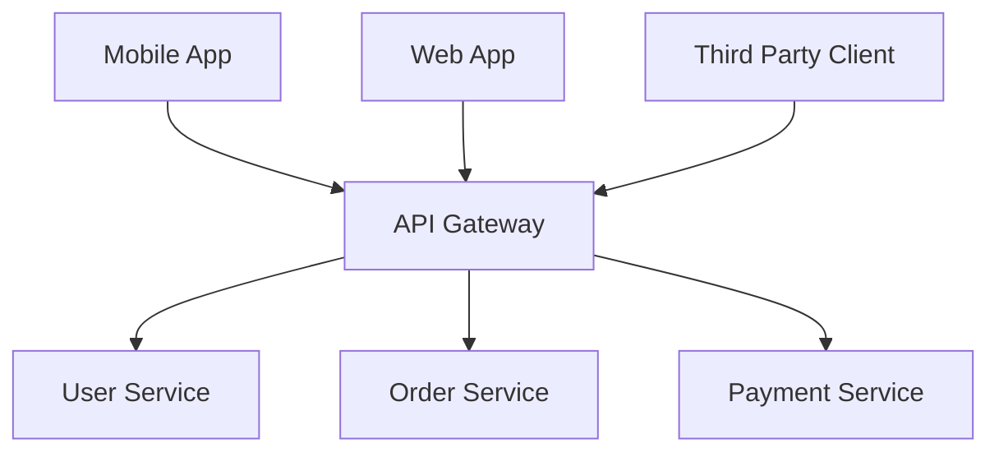
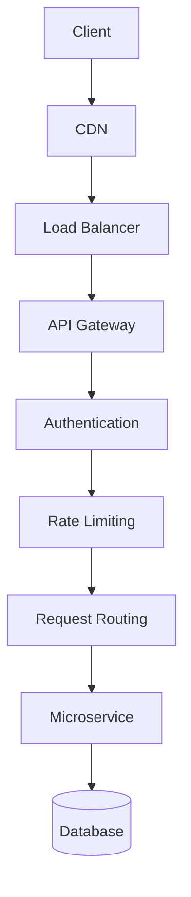
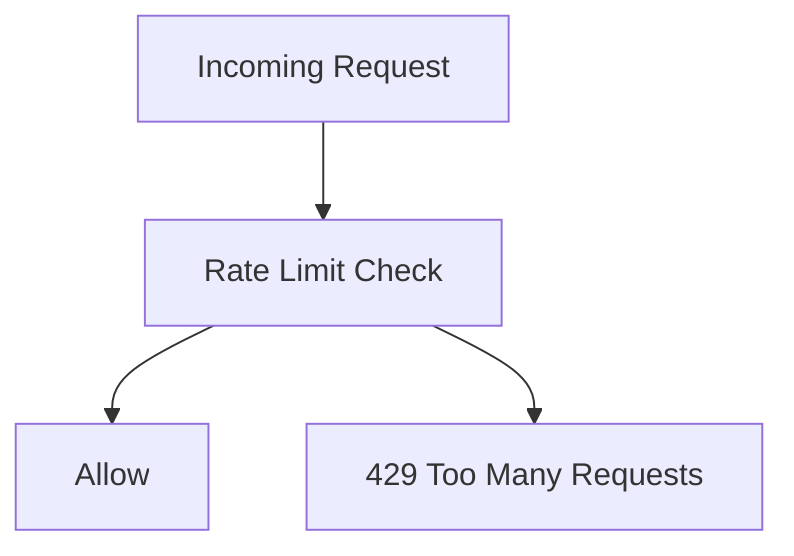
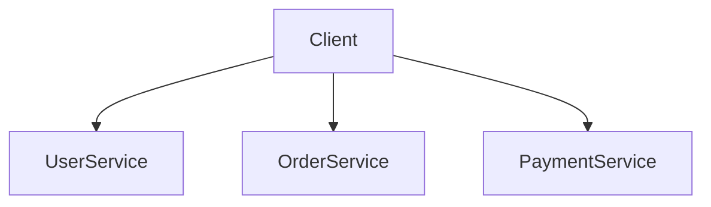
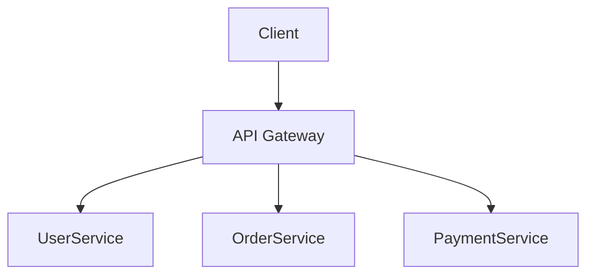
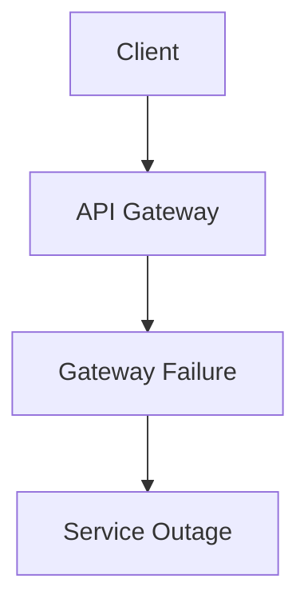
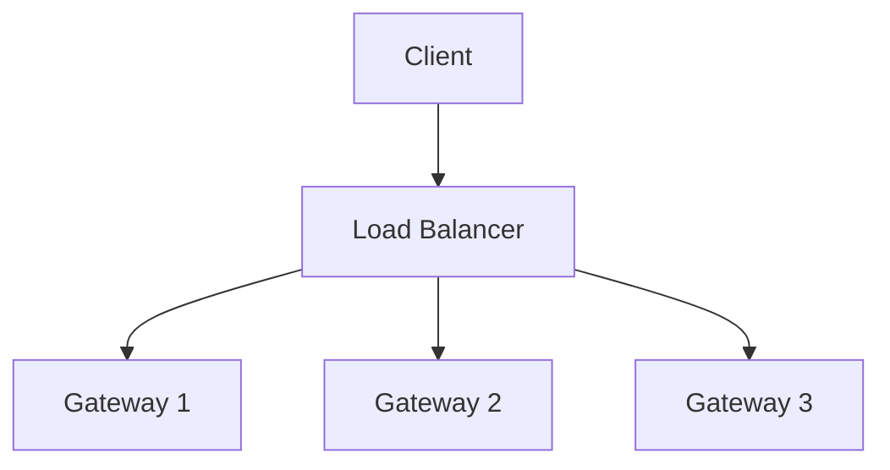

# API Gateway Diagram

## Why It Matters

An API Gateway acts as the single entry point for clients accessing backend services.

Instead of exposing multiple services directly to users, all requests pass through the API Gateway first.

The API Gateway centralizes cross-cutting concerns such as:

- Authentication
- Authorization
- Rate Limiting
- Request Routing
- SSL Termination
- Request Validation
- Logging
- Metrics Collection
- Traffic Control

Modern microservice architectures almost always include an API Gateway.

Common use cases:

- E-Commerce Platforms
- Banking Applications
- SaaS Platforms
- Mobile Applications
- Cloud-Native Systems
- Kubernetes-Based Applications

---

## High-Level Architecture



The API Gateway acts as a centralized traffic management layer between clients and backend services.

---

## Production Request Flow



Typical production flow:

1. Client sends request.
2. CDN handles static content.
3. Load Balancer distributes traffic.
4. API Gateway validates request.
5. Authentication verifies identity.
6. Rate Limiting checks request quota.
7. Gateway routes request.
8. Backend service processes request.
9. Database returns data.
10. Response returned to client.

---

## Core Responsibilities

### Authentication

Validates user identity.

Examples:

- JWT
- OAuth
- OpenID Connect
- API Keys

```text
Client
    ↓
JWT Validation
    ↓
Allow Request
```

---

### Authorization

Determines what the authenticated user can access.

```text
User
    ↓
Role Validation
    ↓
Access Decision
```

Examples:

- Admin Access
- Read Access
- Write Access

---

### Request Routing

Routes traffic to the correct backend service.

```mermaid
flowchart LR

    Request --> Gateway

    Gateway --> UserAPI[/users]
    Gateway --> OrderAPI[/orders]
    Gateway --> PaymentAPI[/payments]
```

Benefits:

- Centralized routing
- Simplified clients
- Easier service evolution

---

### Rate Limiting

Protects backend systems from excessive traffic.



Benefits:

- Prevent abuse
- Protect backend services
- Improve stability

---

### SSL Termination

The API Gateway often handles HTTPS encryption.

```text
HTTPS Request
        ↓
API Gateway
        ↓
HTTP Internal Traffic
```

Benefits:

- Simplified certificate management
- Reduced backend complexity

---

### Observability

The Gateway provides centralized visibility.

Examples:

- Request logs
- Metrics
- Traces
- Error monitoring

```text
Request
    ↓
Gateway
    ↓
Logging + Metrics + Tracing
```

---

## Without API Gateway



Problems:

- Authentication duplicated everywhere
- Rate limiting duplicated everywhere
- Routing logic duplicated
- Harder observability
- Increased operational complexity

---

## With API Gateway



Benefits:

- Single entry point
- Centralized security
- Centralized policies
- Better observability
- Easier service management

---

## API Gateway vs Load Balancer

| Feature | Load Balancer | API Gateway |
|----------|----------|----------|
| Purpose | Traffic Distribution | Request Management |
| Layer | L4/L7 | L7 |
| Authentication | No | Yes |
| Authorization | No | Yes |
| Rate Limiting | Limited | Yes |
| Request Transformation | No | Yes |
| Logging | Basic | Advanced |
| Routing Rules | Simple | Advanced |

---

## Failure Scenario

### API Gateway Failure



Potential impact:

- Complete traffic interruption
- Service unavailability

---

### High Availability Deployment



Benefits:

- High availability
- Fault tolerance
- Horizontal scaling

---

## Production Examples

### Kong

Commonly used for:

- API Management
- Authentication
- Rate Limiting

---

### NGINX

Commonly used for:

- Reverse Proxy
- API Gateway
- Traffic Routing

---

### AWS API Gateway

Provides:

- Managed API Gateway
- Authentication
- Throttling
- Monitoring

---

### Apigee

Provides:

- Enterprise API Management
- Analytics
- Security Controls

---

### Kubernetes Ingress Controller

Often acts as an API Gateway layer for Kubernetes applications.

---

## Common Production Problems

### Authentication Latency

Symptoms:

- Slow API response times

Possible Causes:

- External authentication provider delays
- Token validation overhead

---

### Rate Limiting Misconfiguration

Symptoms:

- Legitimate users blocked

Possible Causes:

- Incorrect threshold values

---

### Routing Errors

Symptoms:

- Requests reach wrong service

Possible Causes:

- Incorrect route configuration

---

### Gateway Bottleneck

Symptoms:

- High latency
- Increased error rates

Possible Causes:

- Insufficient gateway instances
- Traffic growth

---

## Interview Questions

### Basic

- What is an API Gateway?
- Why do we need an API Gateway?
- What problems does it solve?

### Intermediate

- API Gateway vs Load Balancer?
- How does rate limiting work?
- How does authentication work?
- Why is centralized routing useful?

### Advanced

- How would you scale an API Gateway?
- How would you design a highly available API Gateway?
- How does API Gateway fit into a microservices architecture?
- How would you handle multi-region traffic routing?

---

## Quick Revision

```text
API Gateway
→ Single Entry Point

Authentication
→ Identity Verification

Authorization
→ Access Control

Routing
→ Service Selection

Rate Limiting
→ Traffic Protection

SSL Termination
→ HTTPS Handling

Observability
→ Logs + Metrics + Traces

Main Benefits
→ Security
→ Simplicity
→ Reliability
→ Scalability
```

---

## Key Concepts

| Concept | Description |
|----------|----------|
| API Gateway | Central entry point for services |
| Authentication | Verify user identity |
| Authorization | Validate user permissions |
| Routing | Direct requests to services |
| Rate Limiting | Control traffic volume |
| SSL Termination | Handle HTTPS encryption |
| Observability | Logs, metrics, traces |
| High Availability | Avoid downtime |
| Scalability | Handle traffic growth |
| Fault Tolerance | Continue during failures |