# Cache Flow Diagram

## Why It Matters

Caching is one of the most important techniques used to improve application performance and scalability.

Instead of repeatedly reading data from a database, frequently accessed data is stored in a faster storage layer called a cache.

Caching helps:

- Reduce database load
- Improve response time
- Reduce latency
- Improve scalability
- Increase throughput
- Improve user experience

Caching is used in almost every large-scale production system.

Examples:

- E-Commerce Platforms
- Social Media Platforms
- Streaming Platforms
- Banking Systems
- Search Systems
- SaaS Applications

---

## High-Level Architecture

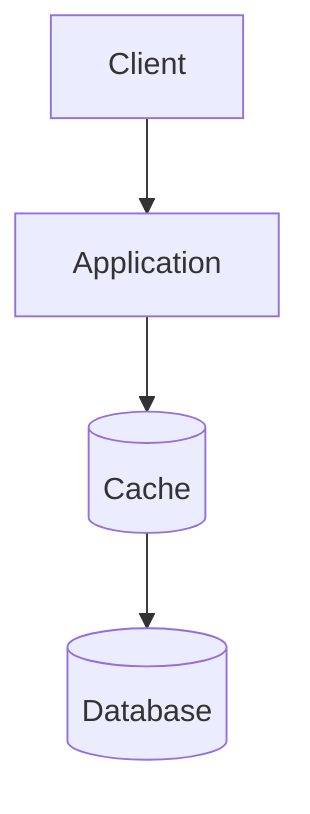

The cache sits between the application and database.

Frequently accessed data is served directly from the cache.

---

## Production Request Flow

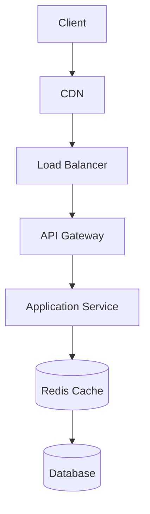

Typical production flow:

1. Client sends request.
2. Request reaches application.
3. Application checks cache.
4. Cache returns data if available.
5. Database accessed only when needed.
6. Response returned to client.

---

## Why Do We Need Cache?

### Without Cache

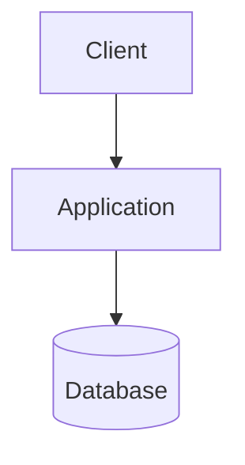

Problems:

- Higher latency
- Increased database load
- Reduced scalability
- Higher infrastructure cost

---

### With Cache


Benefits:

- Faster responses
- Reduced database traffic
- Better scalability
- Improved user experience

---

## Cache Hit Flow

A Cache Hit occurs when requested data already exists in cache.

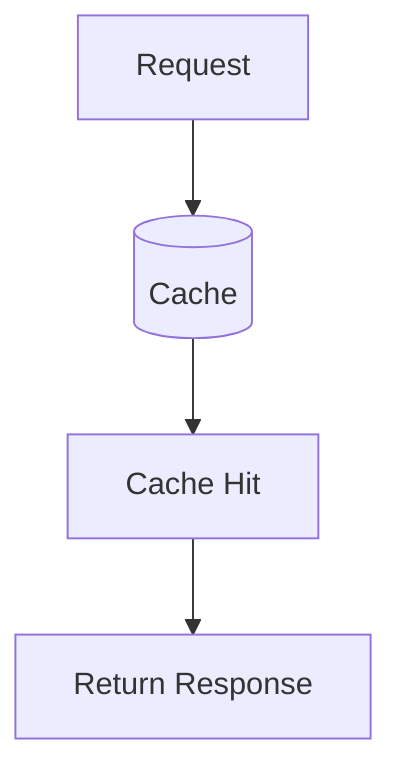

Example:

```text
User Profile Request
        ↓
Profile Found In Redis
        ↓
Return Response
```

Benefits:

- Extremely fast response
- No database access
- Lower infrastructure load

---

## Cache Miss Flow

A Cache Miss occurs when requested data is not available in cache.

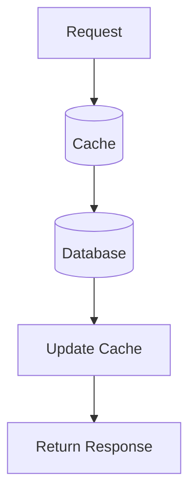

Example:

```text
Product Request
        ↓
Not Found In Cache
        ↓
Read Database
        ↓
Update Cache
        ↓
Return Response
```

Problems:

- Higher latency
- Database dependency

---

## Cache Aside Pattern

The most common caching pattern in production systems.

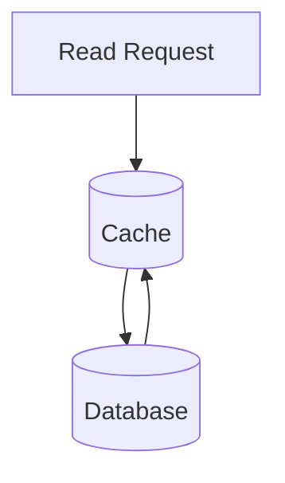

Flow:

```text
Read Request
      ↓
Check Cache
      ↓
Cache Miss
      ↓
Read Database
      ↓
Update Cache
      ↓
Return Response
```

Advantages:

- Simple
- Flexible
- Widely adopted

Best For:

- Product catalogs
- User profiles
- Read-heavy systems

---

## Write Through Cache

Application updates cache and database together.

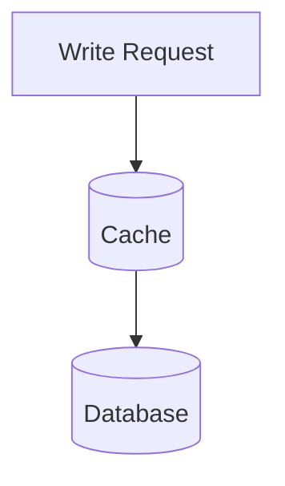

Flow:

```text
Write Request
      ↓
Update Cache
      ↓
Update Database
```

Advantages:

- Strong consistency
- Cache always up-to-date

Disadvantages:

- Slower writes

---

## Write Back Cache

Application updates cache first.

Database updated later asynchronously.

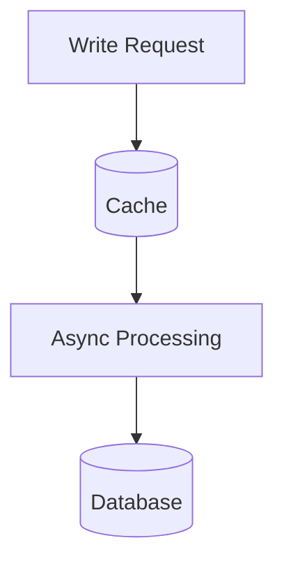

Advantages:

- Very fast writes
- Reduced database load

Disadvantages:

- Potential data loss
- More complex recovery

---

## Write Around Cache

Application writes directly to database.

Cache updated only during reads.

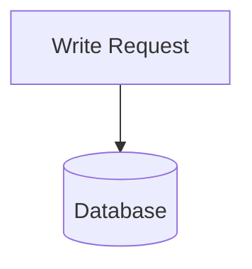

Advantages:

- Avoids cache pollution

Best For:

- Write-heavy workloads

---

## Cache Eviction Policies

### LRU (Least Recently Used)

Removes the least recently accessed data.

```text
Recently Used
      ↓
Keep

Not Used Recently
      ↓
Evict
```

Best For:

- General-purpose caching

---

### LFU (Least Frequently Used)

Removes the least frequently accessed data.

```text
Access Frequency
      ↓
Low Usage
      ↓
Evict
```

Best For:

- Stable access patterns

---

### TTL (Time To Live)

Data expires automatically after a specified time.

```text
Session Data
      ↓
30 Minutes
      ↓
Automatic Expiration
```

Best For:

- Session management
- Temporary data

---

## Distributed Cache Architecture

Large-scale systems use distributed caches.

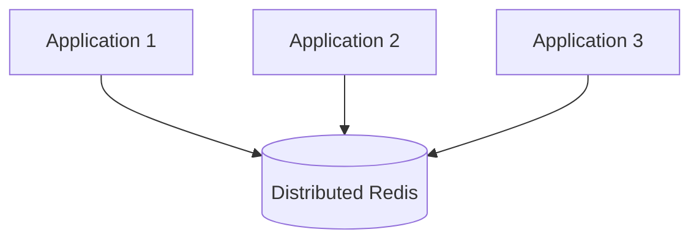

Benefits:

- Shared cache
- Horizontal scaling
- Better resource utilization

Common Technologies:

- Redis
- Memcached
- Hazelcast

---

## Failure Scenario

### Cache Failure

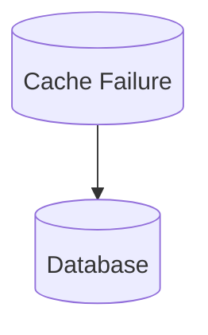

Impact:

- Traffic shifts to database
- Increased latency
- Potential database overload

---

### Cache Stampede

Many requests simultaneously miss cache.

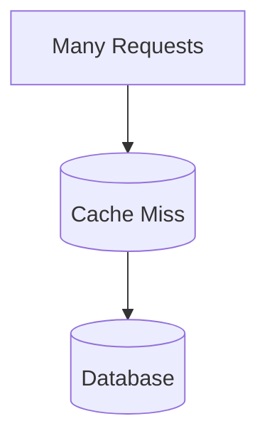

Impact:

- Sudden database spike
- Performance degradation

Common Solutions:

- Request Coalescing
- Distributed Locks
- Pre-Warming Cache

---

## Production Examples

### Redis

Most popular production cache.

Used for:

- Session caching
- API caching
- User profiles
- Shopping carts

---

### Memcached

Used for:

- Simple key-value caching
- High-speed lookups

---

### CDN Cache

Used for:

- Images
- Videos
- Static assets

---

### Database Query Cache

Used for:

- Expensive SQL queries
- Aggregation results

---

## Common Production Problems

### Low Cache Hit Rate

Symptoms:

- High database load

Possible Causes:

- Poor cache strategy
- Small cache size

---

### Stale Data

Symptoms:

- Users see outdated data

Possible Causes:

- Incorrect invalidation logic

---

### Cache Stampede

Symptoms:

- Database traffic spikes

Possible Causes:

- Simultaneous cache expiration

---

### Memory Exhaustion

Symptoms:

- Increased eviction
- Performance degradation

Possible Causes:

- Insufficient cache capacity

---

## Interview Questions

### Basic

- What is caching?
- Why do we use cache?
- What is Cache Hit?
- What is Cache Miss?

### Intermediate

- Cache Aside vs Write Through?
- LRU vs LFU?
- Redis vs Memcached?

### Advanced

- What is Cache Stampede?
- How would you design distributed caching?
- How would you handle stale cache data?
- How would you improve cache hit ratio?

---

## Quick Revision

```text
Cache
→ Faster Responses

Cache Hit
→ Data Found In Cache

Cache Miss
→ Database Access Required

Cache Aside
→ Most Common Pattern

Write Through
→ Better Consistency

Write Back
→ Faster Writes

Redis
→ Most Popular Cache

LRU
→ Remove Least Recently Used

LFU
→ Remove Least Frequently Used

TTL
→ Automatic Expiration

Main Benefits
→ Performance
→ Scalability
→ Lower Database Load
```

---

## Key Concepts

| Concept | Description |
|----------|----------|
| Cache | Fast storage layer |
| Cache Hit | Data found in cache |
| Cache Miss | Database lookup required |
| Cache Aside | Most common cache strategy |
| Write Through | Cache and DB updated together |
| Write Back | Database updated asynchronously |
| LRU | Least Recently Used eviction |
| LFU | Least Frequently Used eviction |
| TTL | Automatic expiration |
| Redis | Distributed in-memory cache |
| Cache Stampede | Massive cache miss event |
| Distributed Cache | Shared cache cluster |