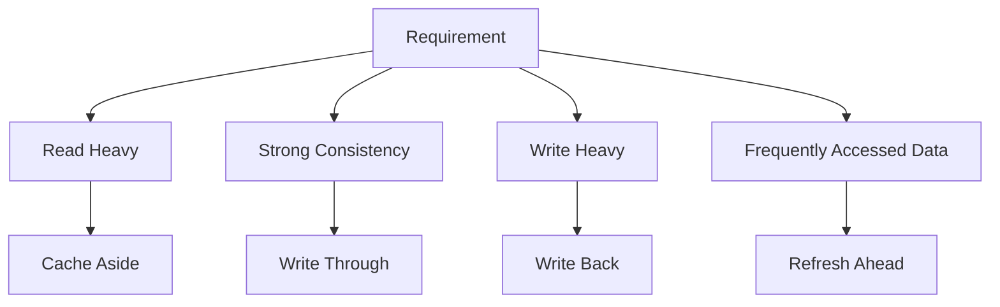
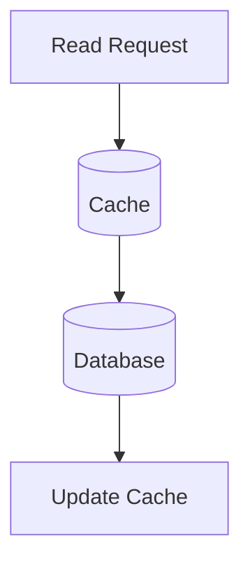
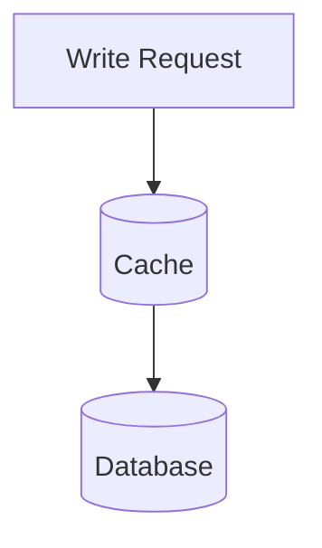
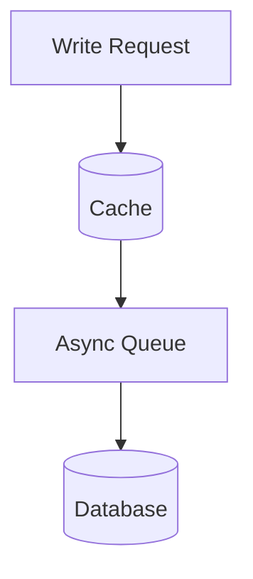
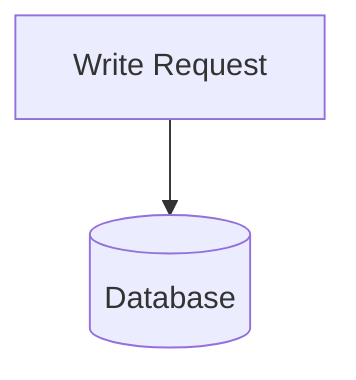
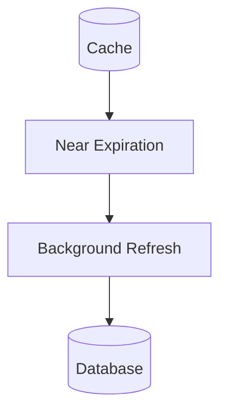
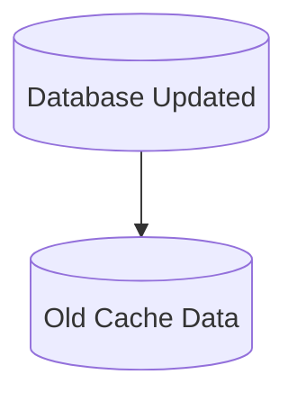
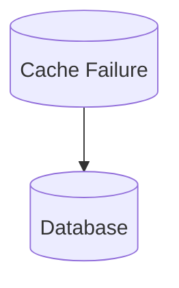
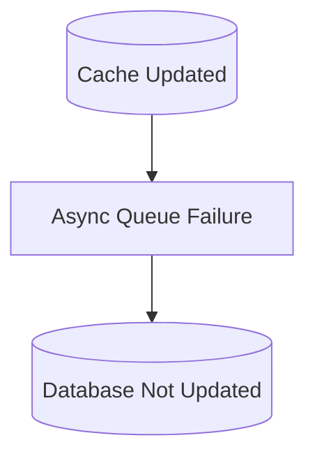

# Cache Patterns Diagram

## Why It Matters

Different caching patterns solve different performance, consistency, and scalability problems.

Choosing the wrong cache pattern can lead to:

- Stale data
- High latency
- Increased database load
- Data consistency issues
- Cache inefficiencies

Choosing the correct cache pattern improves:

- Performance
- Scalability
- Reliability
- User experience

Common use cases:

- E-Commerce Platforms
- Social Networks
- Banking Systems
- SaaS Applications
- Streaming Platforms
- Cloud Services

---

## Cache Pattern Selection Overview



---

## Cache Aside Pattern

The application manages cache operations.

This is the most common caching strategy used in production systems.

### Read Flow



### Flow

```text
Read Request
      ↓
Check Cache
      ↓
Cache Miss
      ↓
Read Database
      ↓
Update Cache
      ↓
Return Response
```

### Advantages

- Simple
- Flexible
- Easy to implement
- Widely adopted

### Disadvantages

- Cache miss latency
- Possible stale data

### Best For

- Product catalogs
- User profiles
- Read-heavy systems

---

## Write Through Pattern

Application updates cache and database together.

### Write Flow



### Flow

```text
Write Request
      ↓
Update Cache
      ↓
Update Database
      ↓
Return Response
```

### Advantages

- Strong consistency
- Cache remains fresh
- Simple read path

### Disadvantages

- Higher write latency
- Additional write overhead

### Best For

- Banking systems
- Financial transactions
- Inventory systems

---

## Write Back Pattern

Also called Write Behind.

Application updates cache immediately.

Database update happens asynchronously.

### Write Flow



### Flow

```text
Write Request
      ↓
Update Cache
      ↓
Return Response
      ↓
Async Database Update
```

### Advantages

- Very fast writes
- Reduced database traffic
- Better throughput

### Disadvantages

- Data loss risk
- Recovery complexity
- Consistency challenges

### Best For

- Analytics systems
- Logging systems
- High-throughput platforms

---

## Write Around Pattern

Writes bypass cache completely.

Only reads populate cache.

### Flow



### Read Flow

```text
Read Request
      ↓
Cache Miss
      ↓
Database
      ↓
Update Cache
```

### Advantages

- Avoids cache pollution
- Efficient for write-heavy systems

### Disadvantages

- Higher read latency after writes

### Best For

- Write-heavy workloads
- Large datasets

---

## Refresh Ahead Pattern

Cache refreshes data before expiration.

### Flow



### Flow

```text
Cache Near Expiry
        ↓
Background Refresh
        ↓
Fresh Data Available
```

### Advantages

- Reduces cache misses
- Improves user experience
- Maintains high cache hit ratio

### Disadvantages

- Additional infrastructure complexity
- Extra database traffic

### Best For

- Frequently accessed data
- Hot content
- Popular products

---

## Pattern Comparison

| Pattern | Read Performance | Write Performance | Consistency | Complexity |
|----------|----------|----------|----------|----------|
| Cache Aside | High | Normal | Medium | Low |
| Write Through | High | Lower | High | Low |
| Write Back | High | Very High | Lower | High |
| Write Around | Medium | High | Medium | Medium |
| Refresh Ahead | Very High | Normal | Medium | High |

---

## Production Examples

### Cache Aside

Used By:

- Amazon
- Netflix
- Facebook
- Most web applications

Technologies:

- Redis
- Memcached

---

### Write Through

Used By:

- Banking systems
- Inventory systems
- Transaction processing

---

### Write Back

Used By:

- Analytics platforms
- Logging systems
- Data processing pipelines

---

### Refresh Ahead

Used By:

- Streaming services
- Content delivery systems
- Search systems

---

## Failure Scenarios

### Stale Cache Data



Impact:

- Incorrect application behavior
- User confusion

Common Causes:

- Missing invalidation
- Delayed refresh

---

### Cache Failure



Impact:

- Database traffic spike
- Increased latency

---

### Async Write Failure



Impact:

- Data inconsistency
- Potential data loss

---

## Pattern Selection Guide

### Choose Cache Aside When

```text
Read Heavy Workload
        ↓
Simple Architecture
        ↓
Most Common Choice
```

---

### Choose Write Through When

```text
Strong Consistency
        ↓
Critical Data
        ↓
Financial Systems
```

---

### Choose Write Back When

```text
High Write Throughput
        ↓
Performance Priority
        ↓
Analytics Workloads
```

---

### Choose Refresh Ahead When

```text
Hot Data
        ↓
Frequent Access
        ↓
Minimize Cache Misses
```

---

## Interview Questions

### Basic

- What is Cache Aside?
- What is Write Through?
- What is Write Back?
- What is Refresh Ahead?

### Intermediate

- Cache Aside vs Write Through?
- Write Through vs Write Back?
- Why is Cache Aside most common?

### Advanced

- How would you handle stale cache data?
- How would you design a distributed cache strategy?
- Which cache pattern would you choose for banking systems?
- Which cache pattern would you choose for analytics systems?

---

## Quick Revision

```text
Cache Aside
→ Most Common Pattern

Write Through
→ Strong Consistency

Write Back
→ Fast Writes

Write Around
→ Avoid Cache Pollution

Refresh Ahead
→ Reduce Cache Misses

Read Heavy
→ Cache Aside

Financial Systems
→ Write Through

Analytics Systems
→ Write Back

Hot Data
→ Refresh Ahead
```

---

## Key Concepts

| Concept | Description |
|----------|----------|
| Cache Aside | Application manages cache |
| Write Through | Cache and DB updated together |
| Write Back | Async database update |
| Write Around | Writes bypass cache |
| Refresh Ahead | Refresh before expiration |
| Cache Consistency | Synchronization of data |
| Cache Miss | Data not found in cache |
| Cache Hit | Data found in cache |
| Stale Data | Outdated cached data |
| Cache Invalidation | Removing outdated cache |