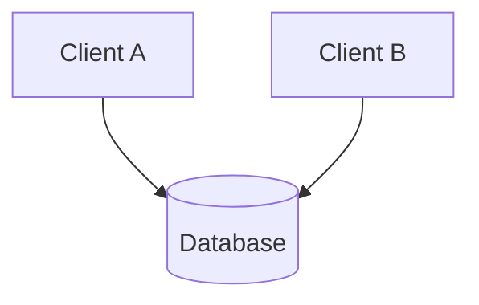
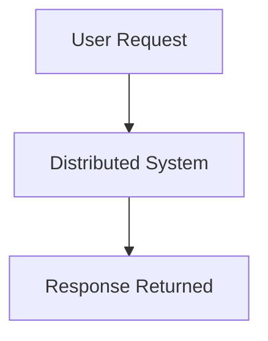
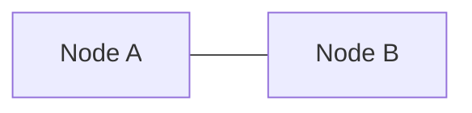
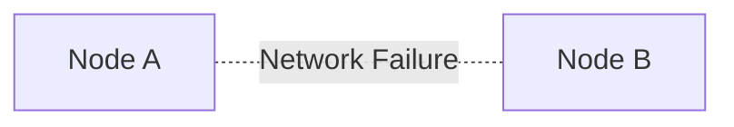
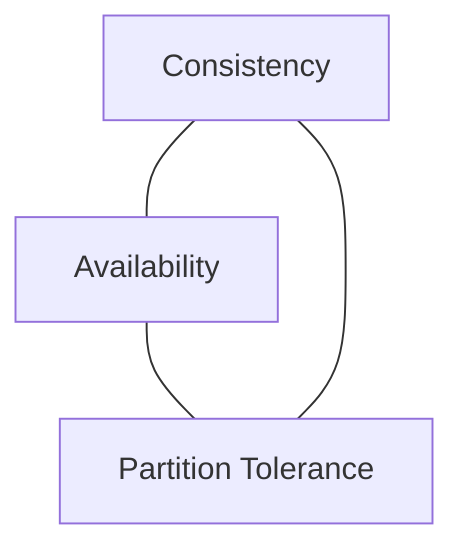
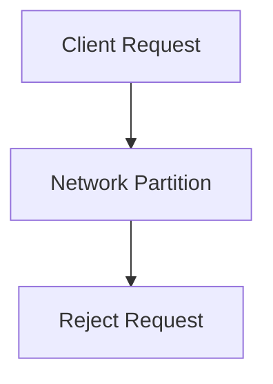
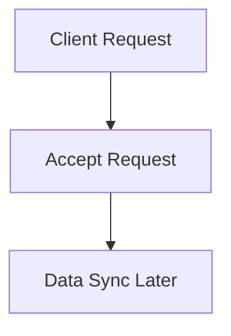

# CAP Theorem Diagram

## Why It Matters

CAP Theorem is one of the most important concepts in distributed systems.

It explains the tradeoffs distributed systems must make when network partitions occur.

CAP stands for:

- Consistency (C)
- Availability (A)
- Partition Tolerance (P)

Understanding CAP helps engineers design:

- Databases
- Distributed systems
- Microservices
- Cloud platforms
- Global applications

CAP is frequently discussed in system design interviews.

---

## What Is CAP Theorem?

CAP Theorem states:

> During a network partition, a distributed system can guarantee either Consistency or Availability, but not both.

In practice:

```text
Partition Tolerance
        ↓
Mandatory
        ↓
Choose:
CP or AP
```

---

## CAP Components

### Consistency (C)

All clients see the same data at the same time.



If Client A writes data:

```text
Balance = ₹500
```

Client B immediately sees:

```text
Balance = ₹500
```

Benefits:

- Correct data
- Predictable behavior
- Strong guarantees

Common Examples:

- Banking Systems
- Payment Platforms
- Inventory Systems

---

### Availability (A)

Every request receives a response.



Even during failures:

```text
Request
      ↓
Response Always Returned
```

Benefits:

- Better uptime
- Better user experience
- Fault tolerance

Common Examples:

- Social Media
- Content Platforms
- Search Systems

---

### Partition Tolerance (P)

System continues operating despite network failures.

### Before Partition



### During Partition



Network communication is lost.

The system must continue operating.

Because network failures are unavoidable:

```text
Partition Tolerance
      ↓
Mandatory
```

for distributed systems.

---

## CAP Visualization



The challenge:

```text
Cannot Guarantee

Consistency
+
Availability
+
Partition Tolerance

Simultaneously During Partition
```

---

## CP Systems

Choose:

```text
Consistency
+
Partition Tolerance
```

Sacrifice:

```text
Availability
```

### Behavior During Failure



System refuses requests rather than returning potentially incorrect data.

Advantages:

- Strong correctness
- No stale data

Disadvantages:

- Reduced availability

Best For:

- Banking
- Payments
- Financial Platforms

Examples:

- HBase
- ZooKeeper
- Etcd
- MongoDB (certain configurations)

---

## AP Systems

Choose:

```text
Availability
+
Partition Tolerance
```

Sacrifice:

```text
Strong Consistency
```

### Behavior During Failure



System remains available but data may temporarily differ.

Advantages:

- High availability
- Better user experience

Disadvantages:

- Temporary inconsistency

Best For:

- Social Platforms
- Feed Systems
- Messaging Systems

Examples:

- Cassandra
- DynamoDB
- Riak

---

## Strong Consistency vs Eventual Consistency

### Strong Consistency

```text
User A Updates Value
        ↓
All Users Immediately See Update
```

Characteristics:

- Correctness prioritized
- Slower operations possible

---

### Eventual Consistency

```text
User A Updates Value
        ↓
Different Nodes Temporarily Differ
        ↓
Eventually Synchronize
```

Characteristics:

- Better availability
- Better scalability

---

## Real-World Example: Social Media

Instagram Like Count:

```text
User A
→ 100 Likes

User B
→ 99 Likes
```

Few seconds later:

```text
User B
→ 100 Likes
```

This is acceptable.

System favors:

```text
Availability
```

Classification:

```text
AP System
```

---

## Real-World Example: Banking

Account Balance:

```text
₹1000
```

Withdrawal:

```text
₹500
```

All nodes must immediately agree:

```text
₹500
```

Showing different balances is unacceptable.

System favors:

```text
Consistency
```

Classification:

```text
CP System
```

---

## CAP and Modern Databases

| Database | Preference |
|----------|----------|
| Cassandra | AP |
| DynamoDB | AP |
| Riak | AP |
| ZooKeeper | CP |
| Etcd | CP |
| HBase | CP |
| MongoDB | Configurable |
| PostgreSQL | Primarily CP |

---

## Common Misconceptions

### CAP Does Not Mean Choosing Any Two

Incorrect:

```text
CA
CP
AP
```

Reality:

```text
Partition Happens
        ↓
Choose CP or AP
```

Distributed systems cannot ignore partitions.

---

### Availability Is Not Uptime

Availability in CAP means:

```text
Every Request Receives Response
```

It does not mean:

```text
99.99% Service Availability
```

Those are different concepts.

---

## Production Tradeoffs

### Choose CP When

```text
Data Correctness Critical
```

Examples:

- Banking
- Payments
- Inventory

---

### Choose AP When

```text
User Experience Critical
```

Examples:

- Social Media
- Search
- Content Platforms

---

## Interview Questions

### Basic

- What is CAP Theorem?
- What does C mean?
- What does A mean?
- What does P mean?

### Intermediate

- Why is Partition Tolerance mandatory?
- CP vs AP?
- Strong Consistency vs Eventual Consistency?

### Advanced

- How does DynamoDB relate to CAP?
- How does Cassandra relate to CAP?
- Can a distributed system support C + A + P?
- How would you choose between CP and AP?

---

## Quick Revision

```text
CAP
→ Consistency Availability Partition Tolerance

Consistency
→ Same Latest Data

Availability
→ Every Request Gets Response

Partition Tolerance
→ Survive Network Failure

CP
→ Correctness Priority

AP
→ Availability Priority

Banking
→ CP

Social Media
→ AP

Eventual Consistency
→ Synchronize Later
```

---

## Key Concepts

| Concept | Description |
|----------|----------|
| Consistency | Same data visible everywhere |
| Availability | Every request receives response |
| Partition Tolerance | Survive network failures |
| CP System | Consistency prioritized |
| AP System | Availability prioritized |
| Strong Consistency | Immediate synchronization |
| Eventual Consistency | Synchronization over time |
| Network Partition | Communication failure between nodes |
| CAP Tradeoff | CP vs AP decision |
| Distributed System | Multiple communicating nodes |