# CDN Flow Diagram

## Why It Matters

A Content Delivery Network (CDN) is a globally distributed network of servers that delivers content from locations closer to users.

Instead of every request traveling to a central origin server, users are served from nearby edge locations.

CDNs help:

- Reduce latency
- Improve page load speed
- Reduce origin server load
- Improve scalability
- Improve availability
- Improve global performance

CDNs are fundamental components of modern internet-scale systems.

Common use cases:

- Websites
- Video Streaming Platforms
- Social Media Platforms
- SaaS Applications
- Mobile Applications
- E-Commerce Systems

---

## High-Level Architecture

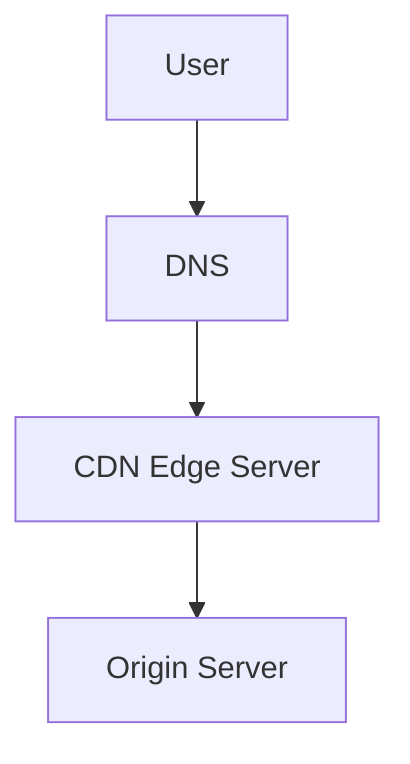

The CDN sits between users and the origin infrastructure.

---

## Production Request Flow

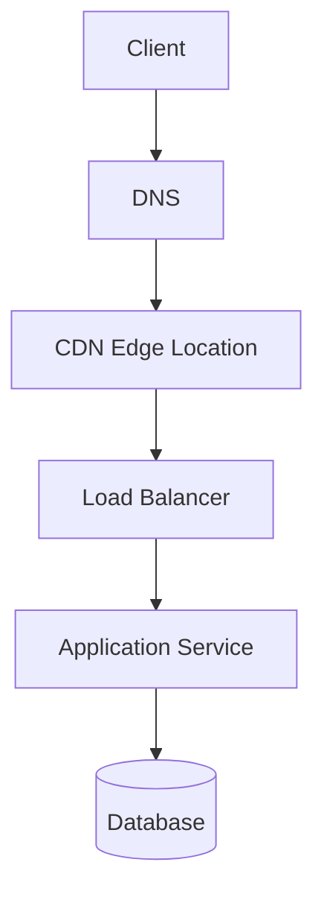

Typical production path:

1. User sends request.
2. DNS routes user to nearest CDN edge.
3. CDN checks cache.
4. Cache hit returns content immediately.
5. Cache miss fetches content from origin.
6. Content cached and returned.

---

## Why Do We Need CDN?

### Without CDN

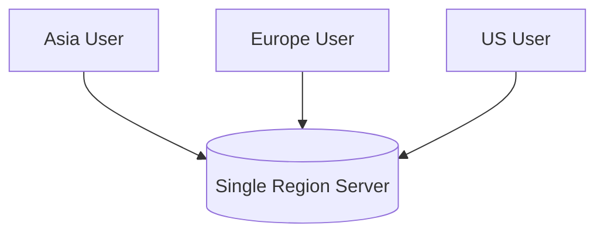

Problems:

- Higher latency
- Long-distance traffic
- Increased origin load
- Poor global experience

---

### With CDN

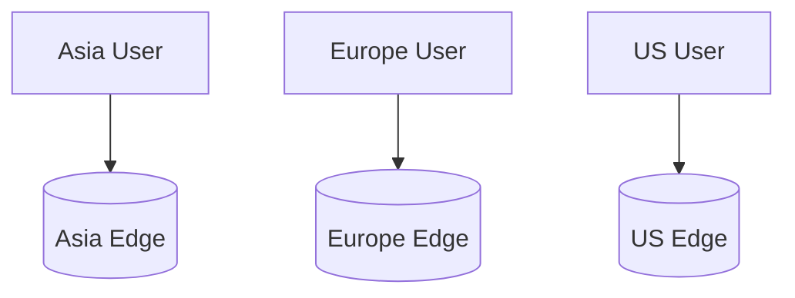

Benefits:

- Lower latency
- Faster delivery
- Better scalability

---

## Cache Hit Flow

A Cache Hit occurs when requested content already exists in the CDN.

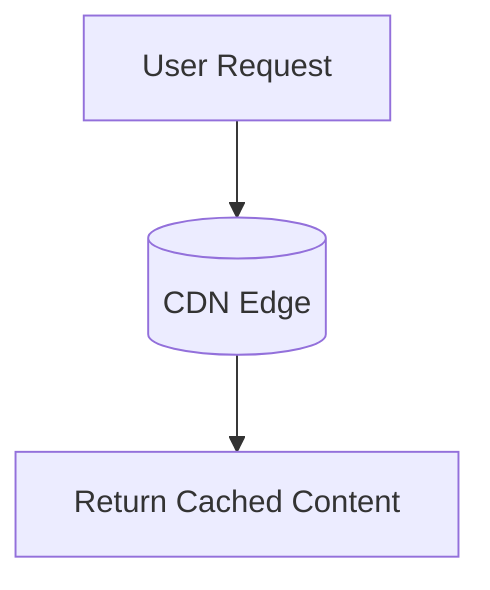

Flow:

```text
User Request
      ↓
CDN Edge
      ↓
Cache Hit
      ↓
Immediate Response
```

Benefits:

- Lowest latency
- Reduced origin traffic
- Better user experience

---

## Cache Miss Flow

A Cache Miss occurs when content is not available at the edge location.

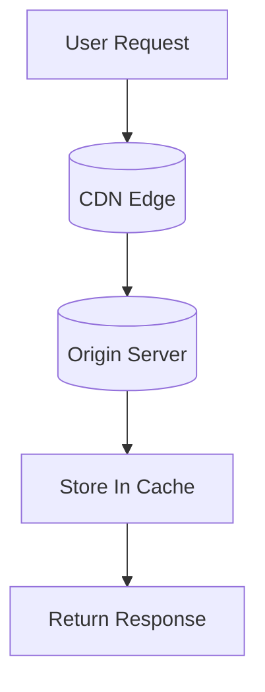

Flow:

```text
User Request
      ↓
CDN Edge
      ↓
Cache Miss
      ↓
Origin Server
      ↓
Cache Content
      ↓
Return Response
```

---

## CDN Edge Locations

CDNs maintain servers around the world.

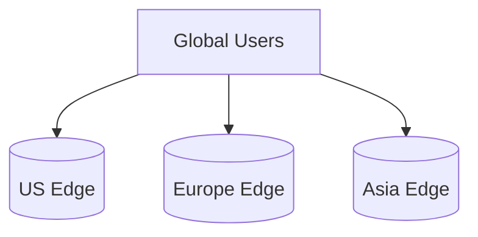

Purpose:

- Serve users locally
- Reduce network distance
- Improve response times

---

## Static Content Delivery

CDNs are highly effective for static content.

Examples:

- Images
- CSS
- JavaScript
- Videos
- PDFs
- Fonts

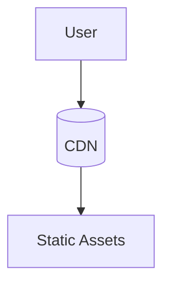

Benefits:

- Reduced bandwidth cost
- Faster loading

---

## Dynamic Content Acceleration

Modern CDNs can also accelerate dynamic requests.

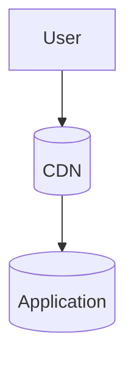

Examples:

- API requests
- Personalized pages
- Authentication flows

---

## CDN Cache Invalidation

Sometimes cached content becomes outdated.

### Example

```text
Image Updated
      ↓
Old Version Still Cached
```

Solution:

```text
Invalidate Cache
      ↓
Fetch New Content
```

---

### Cache Invalidation Flow

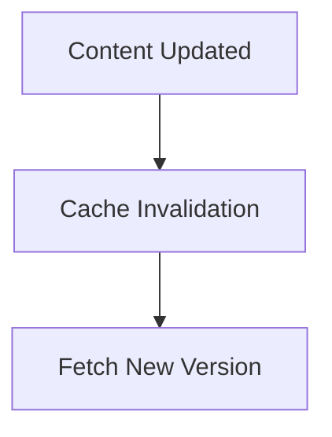

---

## Cache Expiration (TTL)

Cached objects automatically expire.

Example:

```text
Image Cache TTL
      ↓
24 Hours
      ↓
Automatic Refresh
```

Benefits:

- Simpler cache management
- Fresh content delivery

---

## CDN Failure Scenario

### Edge Server Failure

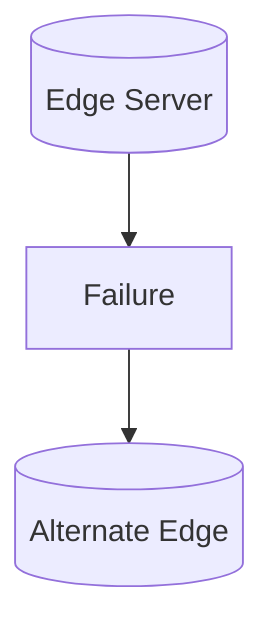

Result:

- Traffic rerouted
- Service remains available

---

### Origin Failure

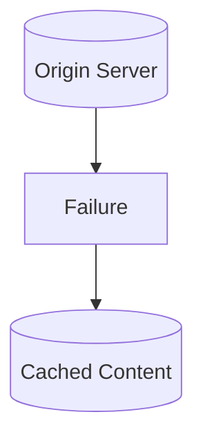

Impact:

```text
Static Content
→ Still Available

Dynamic Content
→ May Fail
```

---

## CDN vs Cache

| CDN | Application Cache |
|----------|----------|
| Global | Usually Local |
| Edge Locations | Application Layer |
| Static Content | Application Data |
| Internet Facing | Internal Systems |
| Reduces Network Latency | Reduces Database Load |

---

## CDN vs Load Balancer

| CDN | Load Balancer |
|----------|----------|
| Delivers Content | Distributes Traffic |
| Global Edge Network | Backend Traffic Management |
| Cache Content | Does Not Cache |
| User-Facing Optimization | Infrastructure Optimization |

---

## Production Examples

### Cloudflare

Provides:

- CDN
- DDoS Protection
- Edge Security

---

### Amazon CloudFront

Provides:

- Global CDN
- AWS Integration
- Edge Caching

---

### Akamai

Provides:

- Global Content Delivery
- Enterprise CDN

---

### Fastly

Provides:

- Real-Time CDN
- Edge Computing

---

## Common Production Problems

### Low Cache Hit Ratio

Symptoms:

```text
High Origin Traffic
```

Causes:

```text
Poor Caching Strategy
```

---

### Stale Content

Symptoms:

```text
Users See Old Content
```

Causes:

```text
Missing Invalidation
```

---

### Origin Overload

Symptoms:

```text
Slow Response Times
```

Causes:

```text
Excessive Cache Misses
```

---

### Regional Latency

Symptoms:

```text
Certain Regions Slower
```

Causes:

```text
Insufficient Edge Coverage
```

---

## Interview Questions

### Basic

- What is a CDN?
- Why do we need a CDN?
- What is a Cache Hit?
- What is a Cache Miss?

### Intermediate

- CDN vs Cache?
- CDN vs Load Balancer?
- How does cache invalidation work?

### Advanced

- How would you design a global CDN?
- How would you improve cache hit ratio?
- How would you handle stale content?
- How does CloudFront work?

---

## Quick Revision

```text
CDN
→ Content Delivery Network

Primary Goal
→ Lower Latency

Edge Location
→ Nearby Server

Cache Hit
→ Immediate Response

Cache Miss
→ Origin Fetch

TTL
→ Cache Expiration

Invalidation
→ Remove Old Content

Main Benefits
→ Performance
→ Scalability
→ Availability
→ Global Reach
```

---

## Key Concepts

| Concept | Description |
|----------|----------|
| CDN | Global content delivery network |
| Edge Server | Local content delivery node |
| Origin Server | Source of truth |
| Cache Hit | Content found at edge |
| Cache Miss | Content fetched from origin |
| TTL | Cache expiration period |
| Cache Invalidation | Remove stale content |
| Static Content | Images, CSS, JS, Videos |
| Dynamic Content | Personalized responses |
| Edge Location | Geographic delivery point |