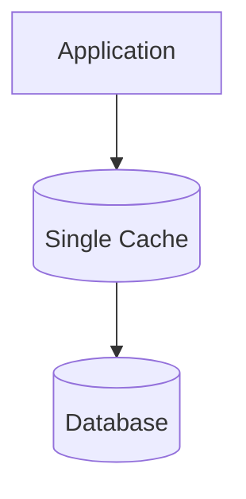
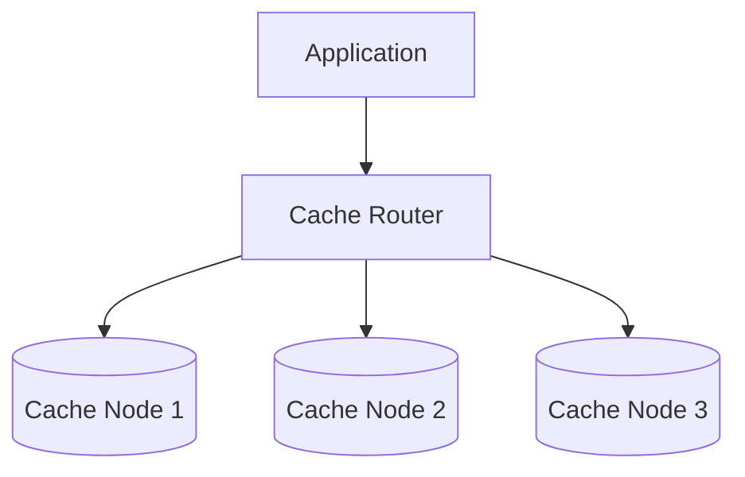
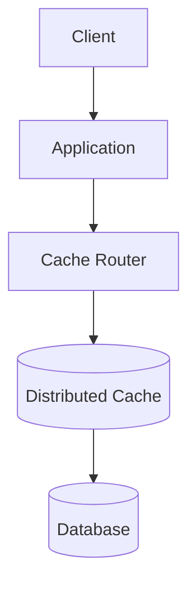
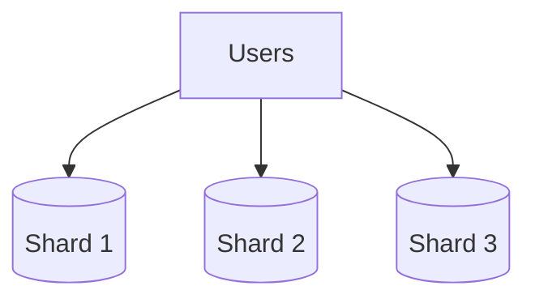
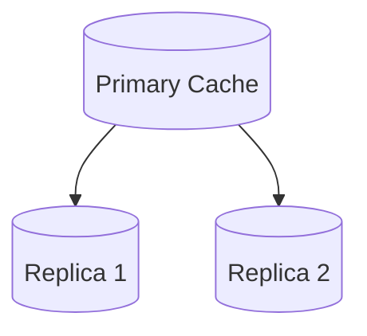
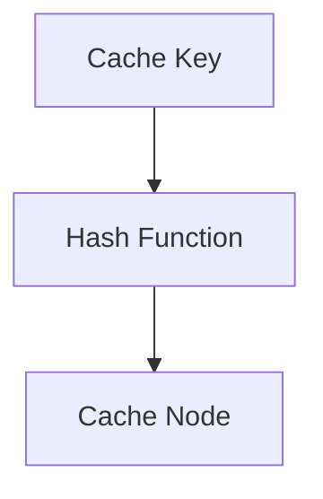
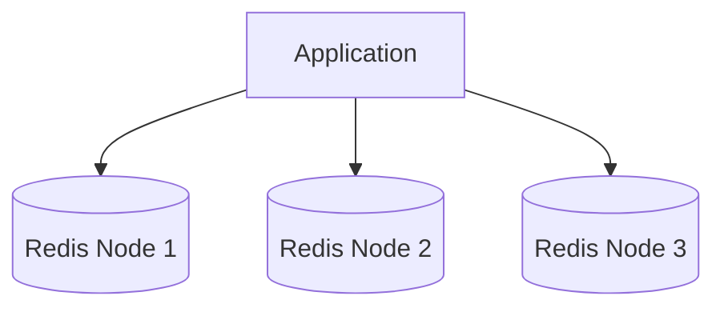
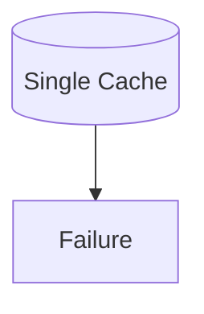
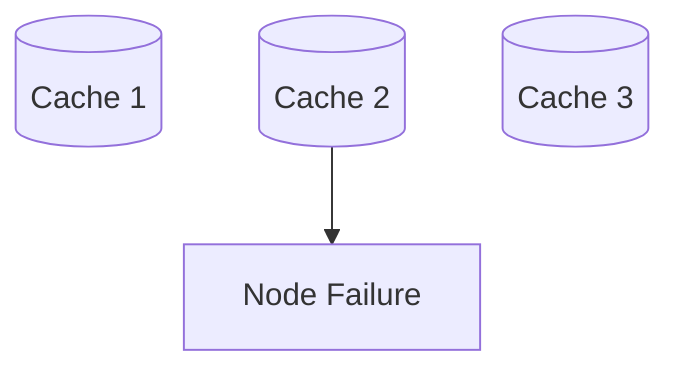
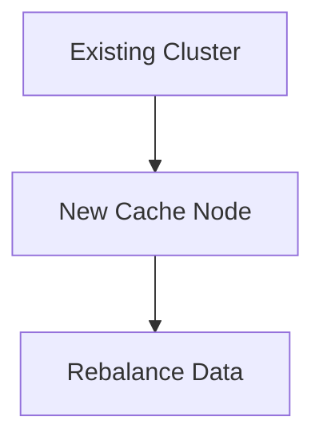

# Distributed Cache Diagram

## Why It Matters

A Distributed Cache stores cached data across multiple cache nodes instead of relying on a single cache server.

As applications grow, a single cache server becomes a bottleneck because of:

- Memory limitations
- CPU limitations
- Network limitations
- Availability risks

Distributed caching helps systems:

- Scale horizontally
- Handle larger workloads
- Improve availability
- Reduce database load
- Improve performance

Common use cases:

- Social Media Platforms
- E-Commerce Systems
- Streaming Platforms
- Banking Applications
- Search Systems

---

## Single Cache Problem

### Traditional Architecture



Problems:

- Limited memory
- Single point of failure
- Traffic bottleneck
- Difficult scaling

---

## Distributed Cache Architecture



Benefits:

- Horizontal scaling
- Better throughput
- Better fault tolerance
- Improved availability

---

## Production Request Flow



Flow:

1. Request reaches application.
2. Application queries distributed cache.
3. Cache returns data if available.
4. Database accessed on cache miss.
5. Cache updated.
6. Response returned.

---

## Data Distribution

Cache keys are distributed across multiple cache nodes.

### Example

```text
User:1001
      ↓
Cache Node 1

User:2001
      ↓
Cache Node 2

User:3001
      ↓
Cache Node 3
```

Benefits:

- Better memory utilization
- Improved throughput
- Better scalability

---

## Cache Sharding

Sharding divides cache data across multiple nodes.

### Sharded Cache Architecture



Example:

```text
Shard 1
→ User 1 - 100000

Shard 2
→ User 100001 - 200000

Shard 3
→ User 200001 - 300000
```

Advantages:

- Horizontal scaling
- Better memory utilization

Disadvantages:

- Rebalancing complexity

---

## Cache Replication

Replication creates copies of cache data.

### Replication Architecture



Benefits:

- High availability
- Better fault tolerance
- Faster recovery

Disadvantages:

- Replication delay
- Additional infrastructure

---

## Consistent Hashing

Consistent Hashing distributes cache keys efficiently.

### Traditional Hashing Problem

```text
Add New Cache Node
        ↓
Most Keys Move
        ↓
Cache Miss Explosion
```

---

### Consistent Hashing Solution



Benefits:

- Minimal data movement
- Easier scaling
- Better distribution

---

## Redis Cluster Architecture

A common production implementation.



Features:

- Sharding
- Replication
- Failover
- Horizontal scaling

---

## Failure Scenario

### Single Cache Failure



Result:

```text
Entire Cache Unavailable
```

---

### Distributed Cache Failure



Result:

```text
Remaining Nodes Continue Serving Traffic
```

Benefits:

- Better resilience
- Improved availability

---

## Cache Rebalancing

When adding new nodes:



Challenges:

- Data movement
- Temporary performance impact

---

## Production Examples

### Redis Cluster

Used For:

- User sessions
- Shopping carts
- Product catalogs
- API responses

---

### Memcached Cluster

Used For:

- High-speed caching
- Large-scale web applications

---

### Hazelcast

Used For:

- In-memory data grids
- Enterprise applications

---

### Apache Ignite

Used For:

- Distributed caching
- Distributed computing

---

## Common Production Problems

### Hot Keys

Symptoms:

```text
One Cache Node Overloaded
```

Cause:

```text
Popular Key Receives Most Traffic
```

---

### Cache Rebalancing

Symptoms:

```text
Temporary Performance Degradation
```

Cause:

```text
Adding Or Removing Nodes
```

---

### Replication Lag

Symptoms:

```text
Stale Cache Reads
```

Cause:

```text
Replication Delay
```

---

### Cache Stampede

Symptoms:

```text
Database Traffic Spike
```

Cause:

```text
Simultaneous Cache Expiration
```

---

## Interview Questions

### Basic

- What is a Distributed Cache?
- Why do we need Distributed Cache?
- What problems does it solve?

### Intermediate

- Sharding vs Replication?
- Why is Consistent Hashing used?
- What is Redis Cluster?

### Advanced

- How would you scale Redis?
- How would you handle hot keys?
- How does Consistent Hashing work?
- How would you design a cache for 100 million users?

---

## Quick Revision

```text
Distributed Cache
→ Multiple Cache Nodes

Sharding
→ Split Data Across Nodes

Replication
→ Copy Data Across Nodes

Consistent Hashing
→ Efficient Key Distribution

Redis Cluster
→ Distributed Redis

Hot Key
→ Uneven Traffic

Main Benefits
→ Scalability
→ Availability
→ Performance
→ Fault Tolerance
```

---

## Key Concepts

| Concept | Description |
|----------|----------|
| Distributed Cache | Multiple cache nodes |
| Sharding | Data partitioning |
| Replication | Data duplication |
| Consistent Hashing | Efficient key distribution |
| Redis Cluster | Distributed Redis deployment |
| Hot Key | Uneven traffic concentration |
| Rebalancing | Data redistribution |
| Cache Router | Routes cache requests |
| Fault Tolerance | Survive node failures |
| Horizontal Scaling | Add more nodes |