# Distributed Lock Diagram

## Why It Matters

A Distributed Lock ensures that only one service instance can access or modify a shared resource at a time.

In distributed systems, multiple application instances may attempt to perform the same operation simultaneously.

Without coordination, this can cause:

- Race conditions
- Duplicate processing
- Double payments
- Inventory inconsistencies
- Data corruption

Distributed Locks provide coordination across multiple servers.

Common use cases:

- Payment processing
- Inventory management
- Distributed schedulers
- Leader election
- Job processing systems
- Resource coordination

---

## The Core Problem

### Multiple Application Instances

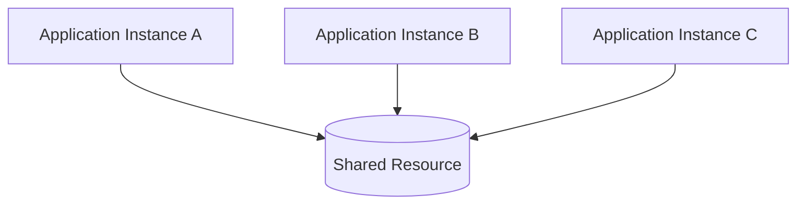

Problem:

```text
Multiple Writers
       ↓
Race Condition
       ↓
Incorrect Results
```

---

## What Is A Distributed Lock?

A Distributed Lock allows only one application instance to own a lock at a given time.

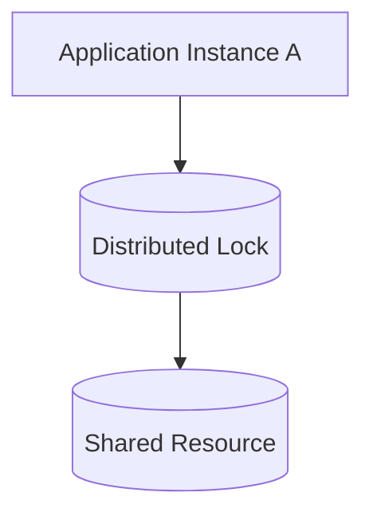

Benefits:

- Controlled access
- Better consistency
- Prevent duplicate execution

---

## High-Level Flow

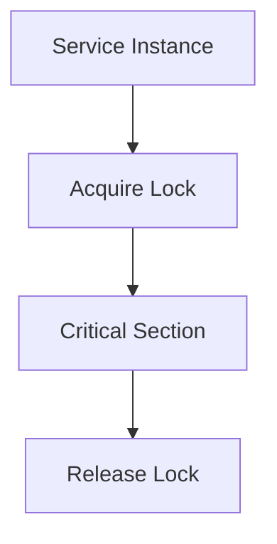

Steps:

1. Request lock.
2. Lock granted.
3. Execute critical operation.
4. Release lock.

---

## Competing Services

### Service A

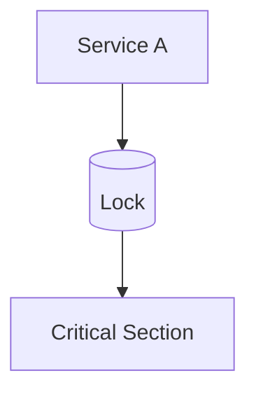

---

### Service B

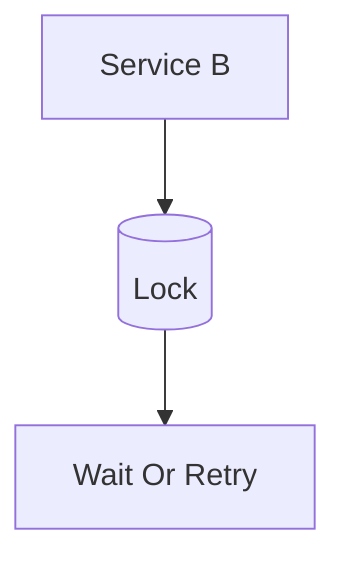

Result:

```text
Only One Service Proceeds
```

---

## Production Architecture

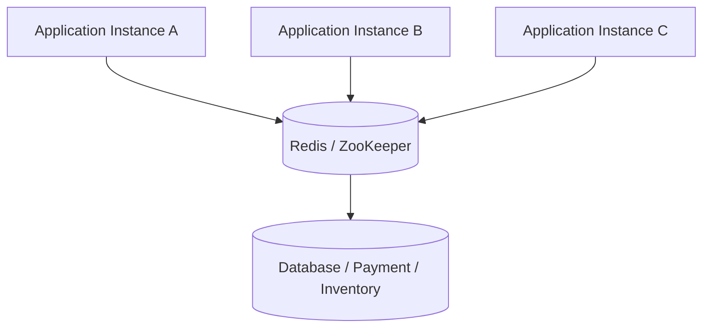

The lock service acts as a centralized coordinator.

---

## Why Distributed Lock?

### Without Lock

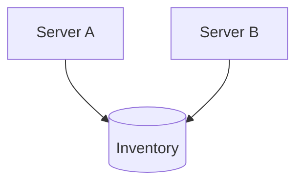

Potential Result:

```text
Inventory = 1

Server A Sells Item
Server B Sells Item

Inventory = -1
```

Problems:

- Overselling
- Data inconsistency
- Business failures

---

### With Lock

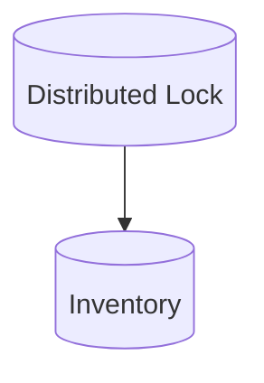

Result:

```text
Single Owner
      ↓
Safe Update
```

---

## Payment Processing Example

Without Lock:

```text
Payment Request
       ↓
Server A Processes

Payment Request
       ↓
Server B Processes

Customer Charged Twice
```

---

With Lock:

```text
Server A Acquires Lock
       ↓
Payment Processed
       ↓
Lock Released
```

Benefits:

- Prevent duplicate payments
- Better consistency

---

## Inventory Management Example

Scenario:

```text
Last Product Available
```

Without Lock:

```text
Two Users Purchase Simultaneously
```

Result:

```text
Overselling
```

With Lock:

```text
First User Gets Lock
       ↓
Inventory Updated
       ↓
Second User Rejected
```

---

## Distributed Scheduler Example

Many instances run the same scheduler.

Without Lock:

```text
Instance A Executes Job

Instance B Executes Job

Instance C Executes Job
```

Result:

```text
Same Job Runs Multiple Times
```

With Lock:

```text
Single Instance Executes Job
```

---

## Leader Election

Distributed systems often elect a leader.

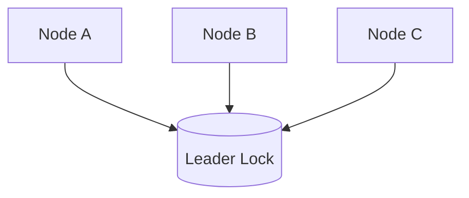

Winner becomes leader.

Examples:

- Kubernetes Controllers
- ZooKeeper
- Etcd

---

## Common Implementations

### Redis Lock

Most popular implementation.

### Flow

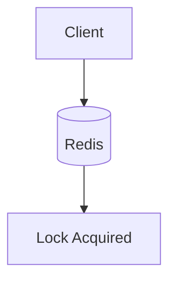

Common command:

```text
SET key value NX EX 30
```

Meaning:

```text
NX
→ Only If Key Does Not Exist

EX
→ Expiration Time
```

Advantages:

- Fast
- Simple
- Widely used

---

### ZooKeeper Lock

Uses ephemeral nodes.

Advantages:

- Strong coordination
- Reliable leader election

Best For:

- Critical distributed systems

---

### Database Row Lock

Uses database locking mechanisms.

Example:

```sql
SELECT *
FROM orders
FOR UPDATE;
```

Advantages:

- Simple
- Built into database

Disadvantages:

- Database overhead

---

## Lock Timeout

Locks should never live forever.

### Problem

```text
Service Acquires Lock
       ↓
Service Crashes
       ↓
Lock Never Released
```

Result:

```text
System Blocked
```

---

### Solution

```text
Lock Expiration
       ↓
Automatic Release
```

Example:

```text
30 Second TTL
```

---

## Distributed Lock Failure Scenario

### Lock Service Failure

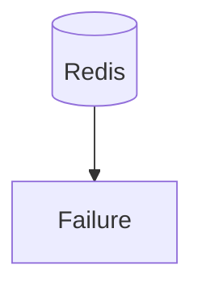

Impact:

- Lock unavailable
- Coordination failures

Solutions:

- Redis Cluster
- Redis Sentinel
- ZooKeeper Cluster

---

## Redlock Algorithm

Redis-based distributed locking algorithm.

Architecture:

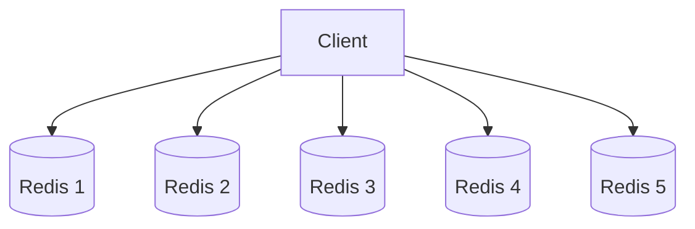

Lock acquired only if majority succeeds.

Purpose:

- Higher reliability
- Better fault tolerance

---

## Distributed Lock vs Optimistic Lock

| Distributed Lock | Optimistic Lock |
|----------|----------|
| Prevents concurrent access | Detects conflicts |
| Coordination based | Version based |
| Distributed systems | Database records |
| More expensive | More scalable |
| Strong control | Retry model |

---

## Distributed Lock vs Database Lock

| Distributed Lock | Database Lock |
|----------|----------|
| Works across services | Database only |
| Coordinates distributed systems | Coordinates transactions |
| Redis / ZooKeeper | Database engine |
| Cross-service control | Single database scope |

---

## Common Production Problems

### Deadlock

Symptoms:

```text
Services Waiting Forever
```

Cause:

```text
Improper Lock Management
```

---

### Lock Expiration

Symptoms:

```text
Another Service Acquires Lock Too Early
```

Cause:

```text
Operation Takes Longer Than TTL
```

---

### Split Brain

Symptoms:

```text
Multiple Lock Owners
```

Cause:

```text
Network Partition
```

---

### Lock Contention

Symptoms:

```text
High Wait Time
```

Cause:

```text
Too Many Services Competing
```

---

## Interview Questions

### Basic

- What is a Distributed Lock?
- Why do we need it?
- What problems does it solve?

### Intermediate

- Redis Lock vs ZooKeeper Lock?
- Why use lock expiration?
- What is lock contention?

### Advanced

- What is Redlock?
- How would you design leader election?
- How would you prevent duplicate payment processing?
- How would you implement a distributed scheduler?

---

## Quick Revision

```text
Distributed Lock
→ Resource Coordination

Race Condition
→ Multiple Writers

Redis Lock
→ SET NX EX

ZooKeeper
→ Strong Coordination

Leader Election
→ Single Active Leader

Lock Timeout
→ Failure Protection

Redlock
→ Multi-Redis Locking

Main Benefits
→ Consistency
→ Coordination
→ Reliability
```

---

## Key Concepts

| Concept | Description |
|----------|----------|
| Distributed Lock | Coordinates distributed systems |
| Race Condition | Concurrent conflicting operations |
| Critical Section | Protected operation |
| Redis Lock | Redis-based locking |
| ZooKeeper Lock | Coordination-based locking |
| Leader Election | Select active leader |
| Lock Timeout | Automatic expiration |
| Redlock | Distributed Redis locking |
| Lock Contention | Multiple lock competitors |
| Deadlock | Services waiting indefinitely |