# Event-Driven Architecture Diagram

## Why It Matters

Event-Driven Architecture (EDA) enables systems to communicate asynchronously using events.

Instead of services calling each other directly, services publish events and other services consume them independently.

This architecture improves:

- Scalability
- Reliability
- Fault isolation
- Throughput
- Service independence

Event-Driven Architecture is widely used in modern distributed systems.

Common use cases:

- Order Processing
- Payment Systems
- Notification Platforms
- Analytics Pipelines
- User Activity Tracking
- IoT Systems

---

## What Is An Event?

An event represents something that happened in the system.

Examples:

```text
Order Created

Payment Completed

User Registered

Inventory Updated

Password Changed
```

Events describe facts.

---

## High-Level Architecture

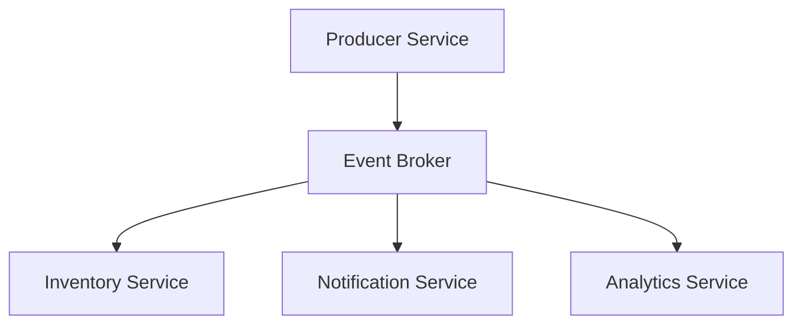

The producer does not know who consumes the event.

This creates loose coupling.

---

## Production Request Flow

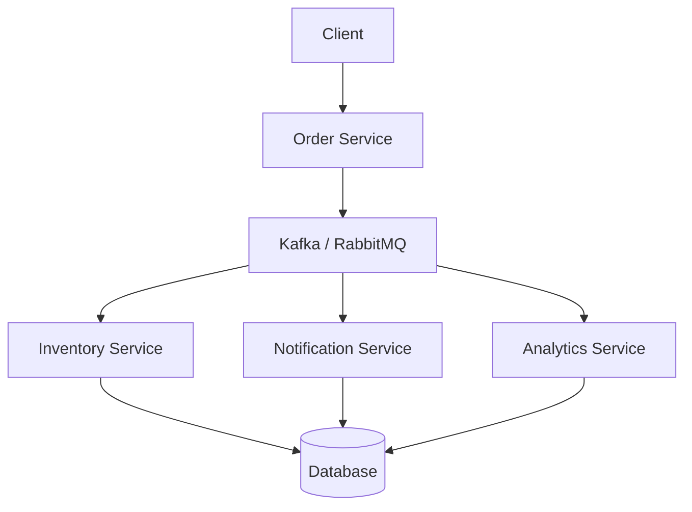

Flow:

1. User creates order.
2. Order service publishes event.
3. Broker stores event.
4. Consumers receive event.
5. Consumers process independently.

---

## Traditional Request-Response Architecture

### Direct Communication

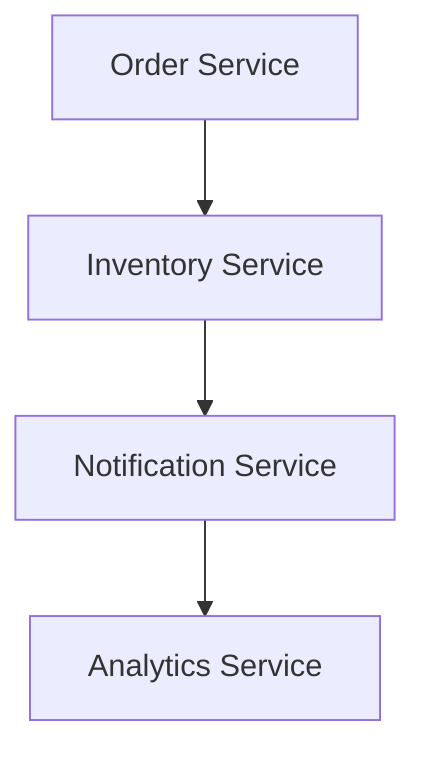

Problems:

- Tight coupling
- Cascading failures
- Higher latency
- Difficult scaling

---

## Event-Driven Architecture

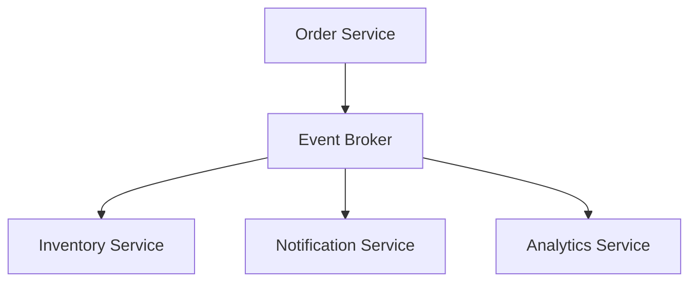

Benefits:

- Loose coupling
- Independent deployment
- Better scalability
- Failure isolation

---

## Core Components

### Producer

Creates and publishes events.

Examples:

```text
Order Service

Payment Service

User Service
```

Example Event:

```json
{
  "event": "OrderCreated",
  "orderId": "12345"
}
```

---

### Event Broker

Receives and distributes events.

Responsibilities:

- Store events
- Route events
- Deliver events
- Retry delivery

Examples:

- Kafka
- RabbitMQ
- Pulsar
- AWS EventBridge

---

### Consumer

Processes events.

Examples:

```text
Inventory Service

Notification Service

Analytics Service
```

Consumers operate independently.

---

## Order Processing Example

### Traditional Approach

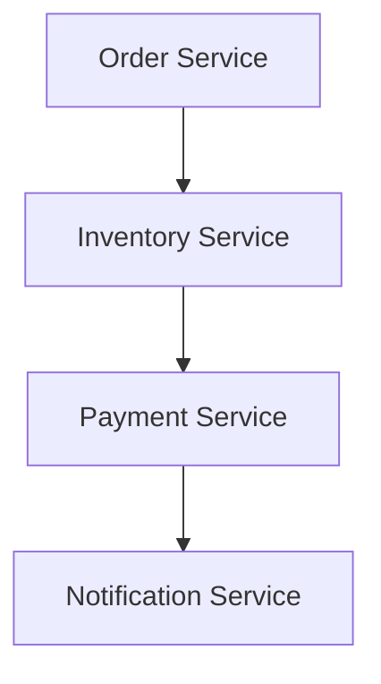

Problems:

- Sequential dependency
- Service coupling

---

### Event-Driven Approach

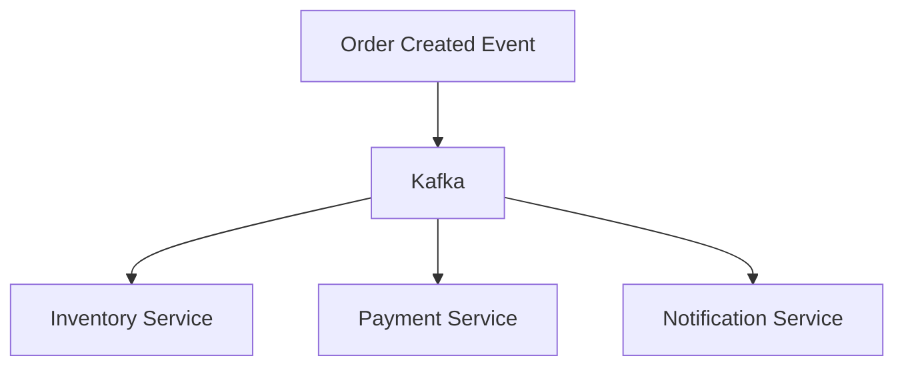

Benefits:

- Parallel processing
- Independent services

---

## Event Delivery Models

### At Most Once

```text
Deliver Once

No Retry
```

Advantages:

- Fast

Disadvantages:

- Possible message loss

---

### At Least Once

```text
Deliver

Retry If Needed
```

Advantages:

- Reliable delivery

Disadvantages:

- Duplicate events possible

---

### Exactly Once

```text
Single Delivery

Single Processing
```

Advantages:

- Highest correctness

Disadvantages:

- Complex implementation

---

## Event Streaming

Events are stored and replayable.

### Architecture

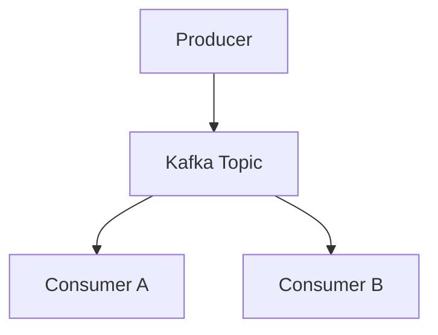

Benefits:

- Replay capability
- Auditability
- Historical analysis

---

## Message Queue vs Event Streaming

| Message Queue | Event Streaming |
|----------|----------|
| Message consumed once | Events retained |
| Queue based | Log based |
| RabbitMQ | Kafka |
| Task processing | Event processing |
| Short retention | Long retention |

---

## Dead Letter Queue (DLQ)

Failed events are moved to a special queue.

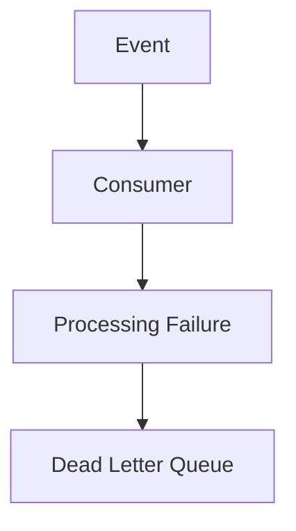

Benefits:

- Prevent data loss
- Easier troubleshooting

---

## Retry Mechanism

Transient failures should be retried.

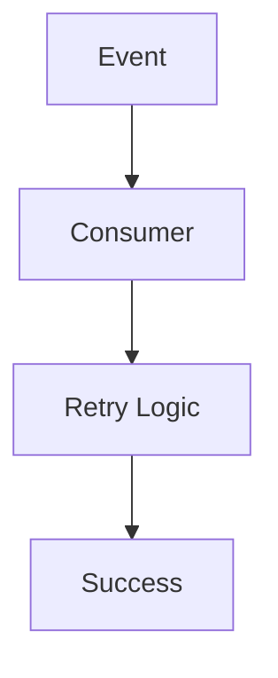

Benefits:

- Improved reliability
- Better fault tolerance

---

## Event Ordering

Some systems require events in exact order.

Example:

```text
Account Created

Account Updated

Account Deleted
```

Wrong order causes inconsistencies.

Solutions:

- Kafka partitions
- Sequence numbers

---

## Eventual Consistency

Event-driven systems commonly use eventual consistency.

```text
Order Created
       ↓
Inventory Updated Later
       ↓
Notification Sent Later
```

Benefits:

- Better scalability
- Better availability

Tradeoff:

```text
Temporary Inconsistency
```

---

## Failure Scenario

### Consumer Failure

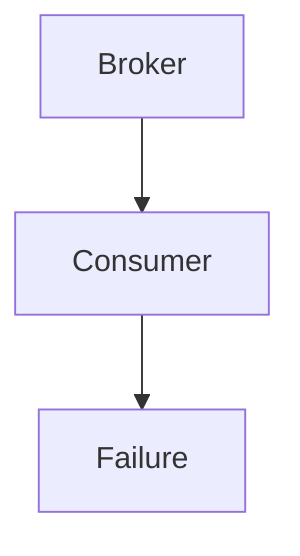

Impact:

- Delayed processing

Solution:

- Retry
- DLQ

---

### Broker Failure

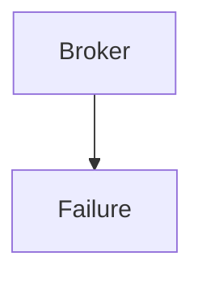

Solution:

- Clustered brokers
- Replication

---

## Production Examples

### Kafka

Best For:

- Event Streaming
- Analytics
- Real-Time Processing

---

### RabbitMQ

Best For:

- Task Queues
- Reliable Delivery

---

### AWS EventBridge

Best For:

- Cloud Event Routing

---

### Apache Pulsar

Best For:

- Large-scale event systems

---

## Common Production Problems

### Duplicate Events

Symptoms:

```text
Same Event Processed Twice
```

Solution:

```text
Idempotent Consumers
```

---

### Event Ordering Issues

Symptoms:

```text
Events Processed Out Of Order
```

Solution:

```text
Partition Strategy
```

---

### Consumer Lag

Symptoms:

```text
Events Backlog Growing
```

Solution:

```text
Scale Consumers
```

---

### Poison Messages

Symptoms:

```text
Repeated Processing Failure
```

Solution:

```text
Dead Letter Queue
```

---

## Interview Questions

### Basic

- What is Event-Driven Architecture?
- What is an event?
- Why use a message broker?

### Intermediate

- Kafka vs RabbitMQ?
- Message Queue vs Event Streaming?
- What is eventual consistency?

### Advanced

- How would you design an order processing system?
- How would you handle duplicate events?
- What is idempotency?
- How would you guarantee event ordering?

---

## Quick Revision

```text
Producer
→ Creates Events

Broker
→ Routes Events

Consumer
→ Processes Events

Kafka
→ Event Streaming

RabbitMQ
→ Message Queue

DLQ
→ Failed Events

Retry
→ Reliability

Eventual Consistency
→ Sync Later

Main Benefits
→ Scalability
→ Reliability
→ Loose Coupling
```

---

## Key Concepts

| Concept | Description |
|----------|----------|
| Event | Something happened |
| Producer | Creates events |
| Consumer | Processes events |
| Broker | Routes events |
| Kafka | Event streaming platform |
| RabbitMQ | Message queue system |
| DLQ | Dead Letter Queue |
| Retry | Reprocess failed events |
| Eventual Consistency | Data synchronizes over time |
| Idempotency | Safe repeated processing |