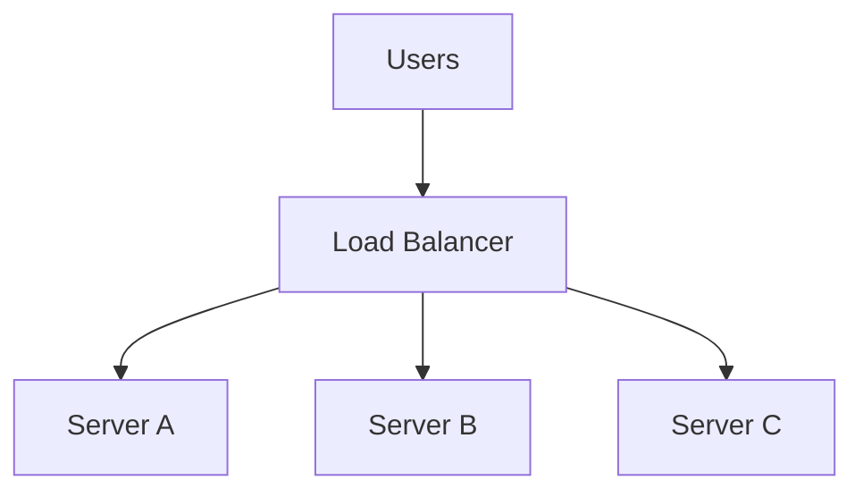
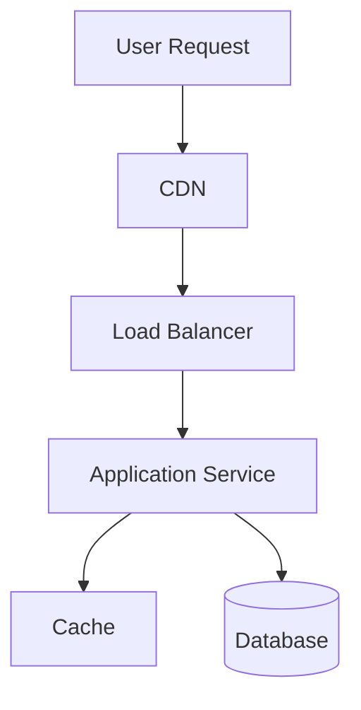
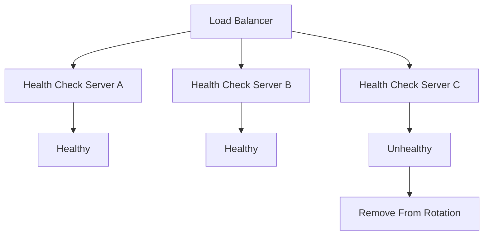
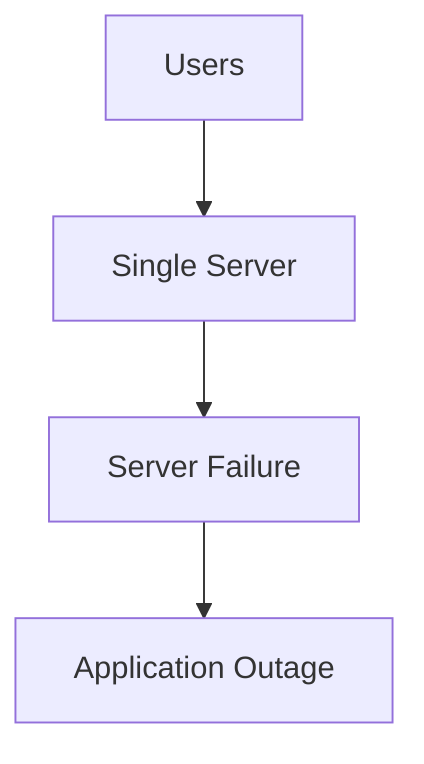
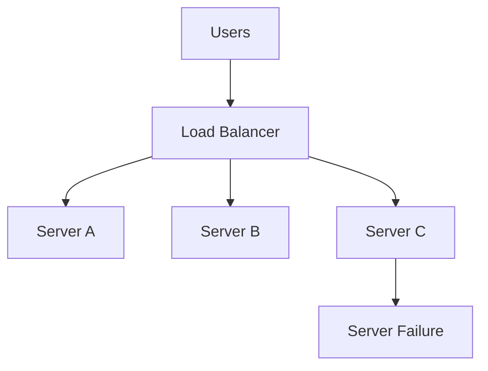
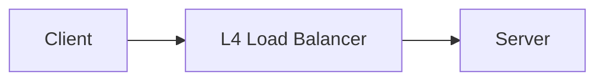

# Load Balancer Flow Diagram

## Why It Matters

A Load Balancer distributes incoming traffic across multiple backend servers.

Without a Load Balancer, all traffic reaches a single server, creating scalability, reliability, and availability problems.

Load Balancers are one of the most fundamental building blocks in modern distributed systems.

Common use cases:

- Web applications
- Microservices platforms
- API platforms
- Kubernetes clusters
- Cloud-native systems
- Media platforms
- E-commerce platforms

---

## High-Level Architecture



The Load Balancer sits between clients and backend servers and distributes requests across available instances.

---

## Production Request Flow



Typical production path:

1. User sends request.
2. CDN serves cached content if available.
3. Request reaches Load Balancer.
4. Load Balancer selects backend server.
5. Application processes request.
6. Cache or database provides data.
7. Response returned to user.

---

## Health Check Flow

A Load Balancer continuously verifies backend health.



Benefits:

- Automatic failure detection
- Improved availability
- Reduced downtime
- Automatic traffic rerouting

---

## Failure Scenario

### Without Load Balancer



Problems:

- Single point of failure
- Downtime
- Poor scalability
- Traffic bottleneck

---

### With Load Balancer



Even if one server fails, traffic continues flowing to healthy servers.

---

## Load Balancing Algorithms

### Round Robin

Traffic is distributed sequentially.

```text
Request 1 → Server A
Request 2 → Server B
Request 3 → Server C
Request 4 → Server A
```

Advantages:

- Simple
- Easy to implement

Best For:

- Similar server capacity

---

### Least Connections

Traffic goes to the server with the fewest active connections.

```text
Server A → 100 Connections
Server B → 40 Connections

New Request → Server B
```

Advantages:

- Better load distribution
- Handles uneven workloads

Best For:

- Variable request processing times

---

### Weighted Round Robin

Servers receive traffic proportional to assigned weights.

```text
Server A Weight = 5
Server B Weight = 3
Server C Weight = 2
```

Advantages:

- Supports heterogeneous infrastructure

Best For:

- Different server capacities

---

### IP Hash

Client IP determines backend server.

```text
Client IP
      ↓
Hash Function
      ↓
Specific Server
```

Advantages:

- Session persistence

Best For:

- Stateful applications

---

## Layer 4 vs Layer 7 Load Balancer

| Feature | Layer 4 | Layer 7 |
|----------|----------|----------|
| Works On | TCP/UDP | HTTP/HTTPS |
| Speed | Faster | Slightly Slower |
| Routing | Network Level | Application Level |
| Content Awareness | No | Yes |
| Header Based Routing | No | Yes |
| Path Based Routing | No | Yes |

### Layer 4 Flow



Operates using:

- IP Address
- TCP Port

---

### Layer 7 Flow

```mermaid
flowchart LR

    Client --> LB[L7 Load Balancer]

    LB --> API[/api]
    LB --> WEB[/web]
    LB --> ADMIN[/admin]
```

Operates using:

- URL Path
- Headers
- Cookies
- Host Names

---

## Production Examples

### NGINX

Commonly used for:

- Reverse Proxy
- Layer 7 Load Balancing

---

### HAProxy

Commonly used for:

- High-performance traffic distribution
- Large-scale systems

---

### AWS Application Load Balancer (ALB)

Supports:

- HTTP
- HTTPS
- Path-based routing

---

### AWS Network Load Balancer (NLB)

Supports:

- TCP
- UDP
- High throughput workloads

---

### Kubernetes Service

Used for:

- Pod traffic distribution
- Service discovery

---

## Common Production Problems

### Uneven Traffic Distribution

Symptoms:

- One server overloaded
- Other servers idle

Possible Causes:

- Poor balancing algorithm
- Sticky sessions

---

### Health Check Misconfiguration

Symptoms:

- Healthy servers removed
- Unhealthy servers still receiving traffic

Possible Causes:

- Incorrect health endpoints
- Aggressive timeout settings

---

### Session Affinity Issues

Symptoms:

- User sessions lost
- Authentication failures

Possible Causes:

- Missing sticky session configuration

---

### Load Balancer Bottleneck

Symptoms:

- High latency
- Request timeout

Possible Causes:

- Under-sized infrastructure
- Network limitations

---

## Interview Questions

### Basic

- What is a Load Balancer?
- Why do we need a Load Balancer?
- What problems does it solve?
- What is session affinity?

### Intermediate

- Round Robin vs Least Connections?
- Layer 4 vs Layer 7?
- What are health checks?
- What happens when a backend server fails?

### Advanced

- How does a Load Balancer scale?
- How does Kubernetes perform load balancing?
- How would you design a global load balancing system?
- How would you handle cross-region failover?

---

## Quick Revision

```text
Load Balancer
→ Distributes Traffic

Health Check
→ Detects Unhealthy Servers

Round Robin
→ Sequential Distribution

Least Connections
→ Dynamic Distribution

Weighted Round Robin
→ Capacity-Aware Distribution

IP Hash
→ Session Affinity

Layer 4
→ TCP/UDP Routing

Layer 7
→ HTTP/HTTPS Routing

Main Benefits
→ Availability
→ Reliability
→ Scalability
```

---

## Key Concepts

| Concept | Description |
|----------|----------|
| Load Balancer | Distributes requests across servers |
| Health Check | Detects unhealthy backends |
| Session Affinity | Routes user to same server |
| Round Robin | Equal request distribution |
| Least Connections | Dynamic load distribution |
| Layer 4 | TCP/UDP load balancing |
| Layer 7 | HTTP/HTTPS load balancing |
| High Availability | Reduces downtime |
| Scalability | Handles increasing traffic |
| Fault Tolerance | Survives server failures |