# Microservices Architecture Diagram

## Why It Matters

Microservices Architecture is an architectural style where an application is built as a collection of small, independently deployable services.

Each service:

- Owns a specific business capability
- Has its own codebase
- Can be deployed independently
- Can scale independently
- Owns its own data

Microservices enable organizations to build large-scale systems while allowing teams to work independently.

Common use cases:

- E-Commerce Platforms
- Banking Systems
- SaaS Applications
- Streaming Platforms
- Ride Sharing Platforms
- Social Media Systems

---

## What Are Microservices?

Instead of building one large application, functionality is divided into smaller services.

Example:

```text
User Service
Order Service
Payment Service
Notification Service
Inventory Service
```

Each service is responsible for a single business domain.

---

## High-Level Architecture

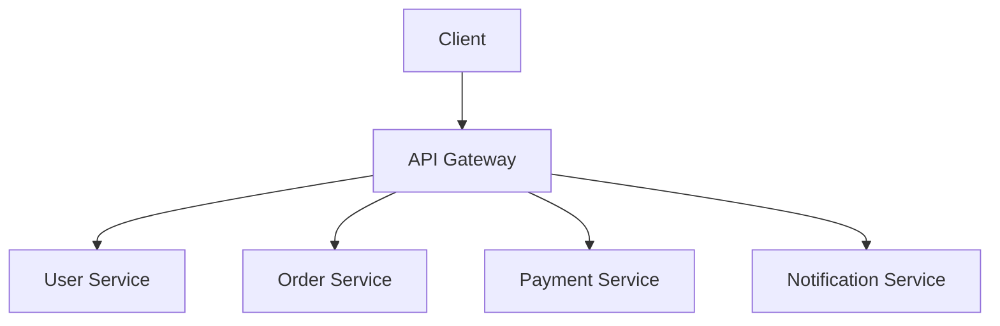

The API Gateway acts as the entry point to the microservice ecosystem.

---

## Production Architecture

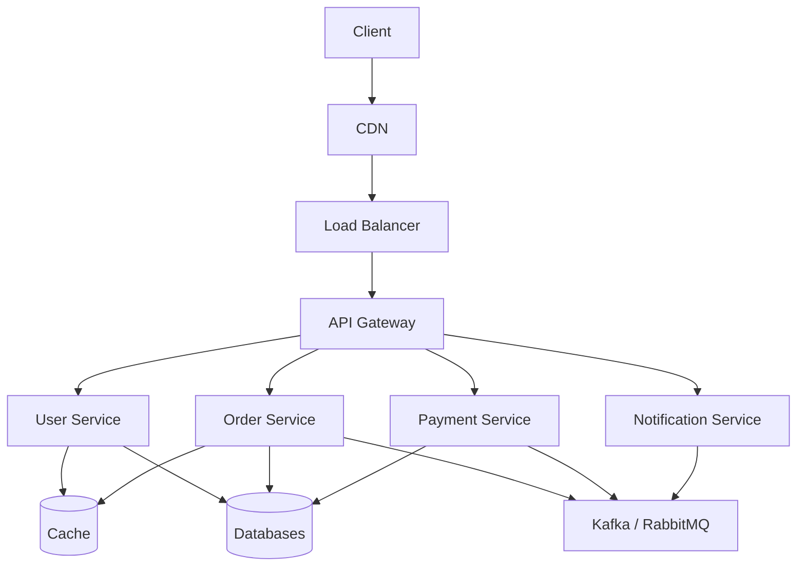

Modern production environments often combine:

- API Gateway
- Service Discovery
- Message Brokers
- Distributed Caching
- Observability Platforms

---

## Monolith vs Microservices

### Monolithic Architecture

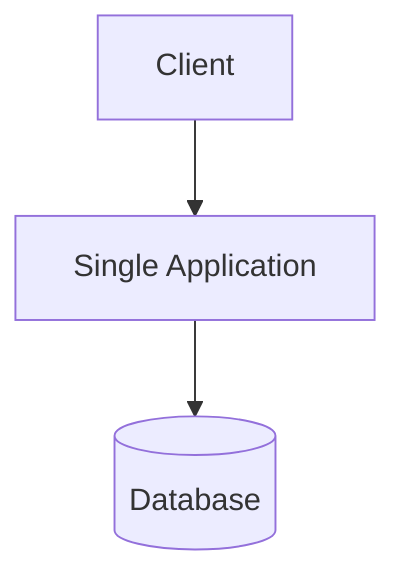

Advantages:

- Simpler development
- Easier deployment
- Easier debugging

Disadvantages:

- Tight coupling
- Difficult scaling
- Large deployments
- Slower release cycles

---

### Microservices Architecture

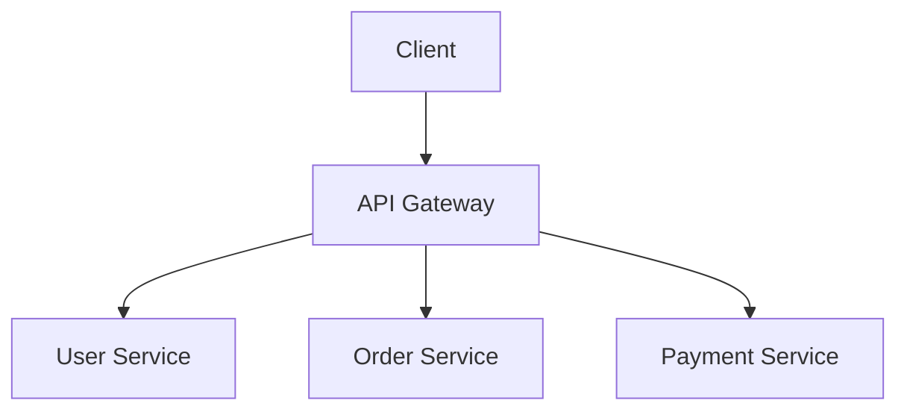

Advantages:

- Independent deployment
- Independent scaling
- Team autonomy
- Better fault isolation

Disadvantages:

- Operational complexity
- Distributed system challenges

---

## Service Ownership

Each service owns its business domain.

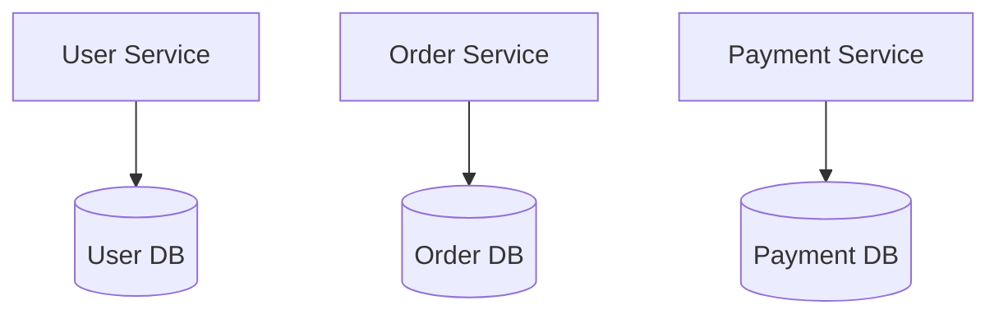

Principle:

```text
Database Per Service
```

Benefits:

- Better isolation
- Independent evolution
- Reduced coupling

---

## Synchronous Communication

Services communicate directly.

### REST

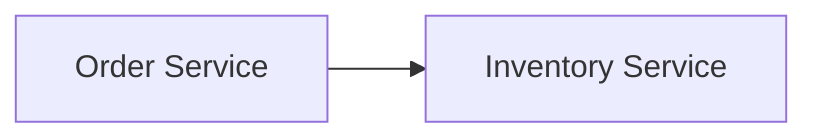

---

### gRPC

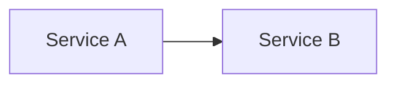

Advantages:

- Fast response
- Simpler flow

Disadvantages:

- Tight runtime dependency

---

## Asynchronous Communication

Services communicate using events.

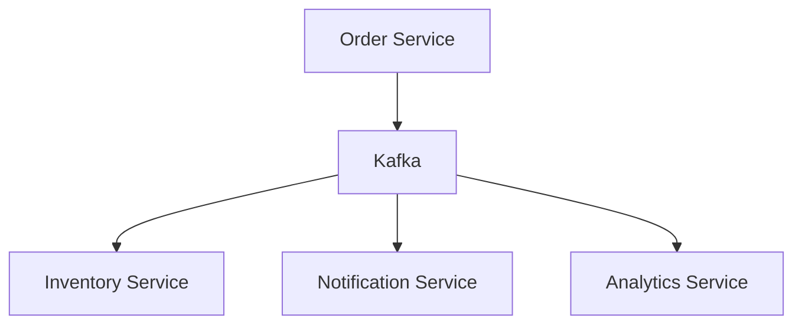

Advantages:

- Loose coupling
- Better scalability
- Failure isolation

---

## Service Discovery

Services need to find each other dynamically.

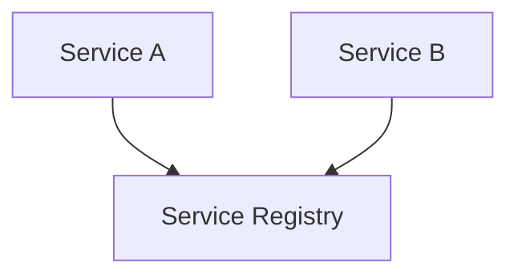

Common solutions:

- Consul
- Eureka
- Kubernetes DNS

Benefits:

- Dynamic service location
- Easier scaling

---

## API Gateway

Acts as the central entry point.

Responsibilities:

- Authentication
- Authorization
- Routing
- Rate Limiting
- Logging

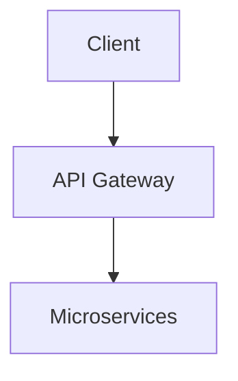

Benefits:

- Centralized security
- Simplified clients

---

## Distributed Transactions Problem

### Example

```text
Order Created
      ↓
Payment Charged
      ↓
Inventory Reserved
```

If payment succeeds but inventory fails:

```text
Inconsistent State
```

Challenge:

```text
Multiple Databases
```

---

## Saga Pattern

A common solution for distributed transactions.

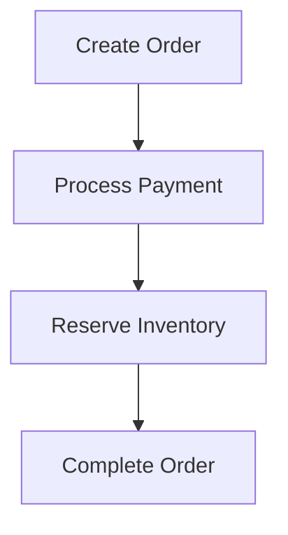

If a step fails:

```text
Compensating Actions Execute
```

Benefits:

- Eventual consistency
- No global transaction manager

---

## Fault Isolation

Failure in one service should not bring down the entire system.

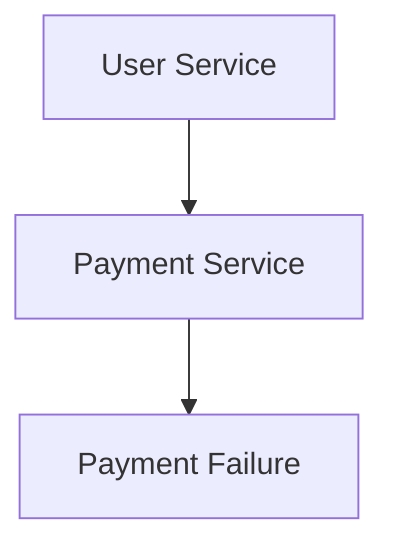

Desired behavior:

```text
Payment Fails

User Service Continues
```

---

## Circuit Breaker Pattern

Prevents cascading failures.

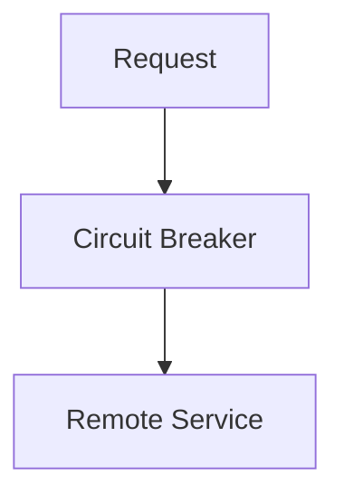

Benefits:

- Failure isolation
- Faster recovery

---

## Observability

Microservices require strong observability.

Components:

```text
Logs
Metrics
Tracing
Alerting
```

### Observability Architecture

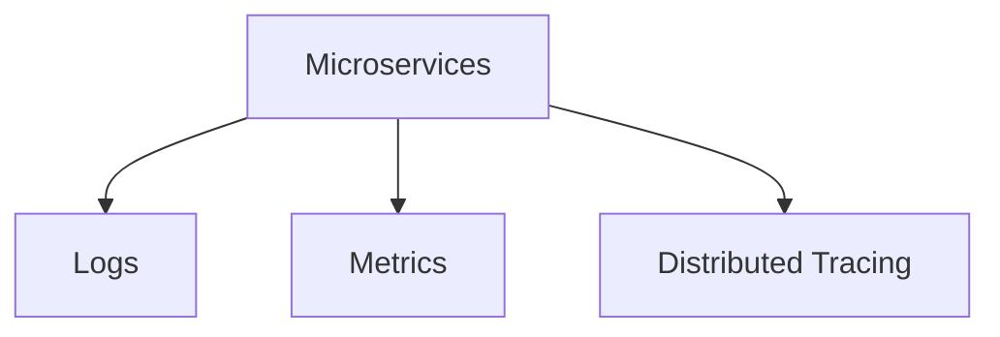

Common tools:

- Prometheus
- Grafana
- Jaeger
- OpenTelemetry

---

## Production Examples

### Netflix

Uses:

- Thousands of microservices
- API Gateway
- Service Discovery

---

### Amazon

Uses:

- Service-oriented architecture
- Independent teams
- Distributed ownership

---

### Uber

Uses:

- Large-scale microservices
- Event-driven communication

---

### Spotify

Uses:

- Domain-oriented services
- Independent deployment

---

## Common Production Problems

### Distributed Tracing

Symptoms:

```text
Difficult Debugging
```

Cause:

```text
Request Crosses Many Services
```

---

### Service Dependency Failure

Symptoms:

```text
Cascading Outages
```

Cause:

```text
Tight Runtime Dependencies
```

---

### Data Consistency

Symptoms:

```text
Different Services Show Different Data
```

Cause:

```text
Distributed Databases
```

---

### Deployment Complexity

Symptoms:

```text
Operational Overhead
```

Cause:

```text
Large Number Of Services
```

---

## When Not To Use Microservices

Avoid Microservices when:

```text
Small Team

Small Product

Simple Business Logic

Early Startup
```

A monolith is often the better choice initially.

---

## Interview Questions

### Basic

- What are Microservices?
- Why do we use them?
- Monolith vs Microservices?

### Intermediate

- API Gateway role?
- Service Discovery?
- Database Per Service?

### Advanced

- How would you handle distributed transactions?
- What is the Saga Pattern?
- How would you prevent cascading failures?
- How would you observe hundreds of services?

---

## Quick Revision

```text
Microservices
→ Independent Services

API Gateway
→ Entry Point

Database Per Service
→ Ownership Model

REST / gRPC
→ Synchronous Communication

Kafka / RabbitMQ
→ Asynchronous Communication

Service Discovery
→ Find Services

Saga Pattern
→ Distributed Transactions

Circuit Breaker
→ Failure Protection

Observability
→ Logs Metrics Traces
```

---

## Key Concepts

| Concept | Description |
|----------|----------|
| Microservices | Independent business services |
| API Gateway | Central entry point |
| Service Discovery | Dynamic service lookup |
| REST | HTTP-based communication |
| gRPC | High-performance RPC |
| Kafka | Event streaming platform |
| Saga Pattern | Distributed transaction pattern |
| Circuit Breaker | Failure isolation mechanism |
| Database Per Service | Independent data ownership |
| Observability | Logs, metrics, traces |
| Fault Isolation | Limit failure impact |
| Independent Deployment | Release services separately |