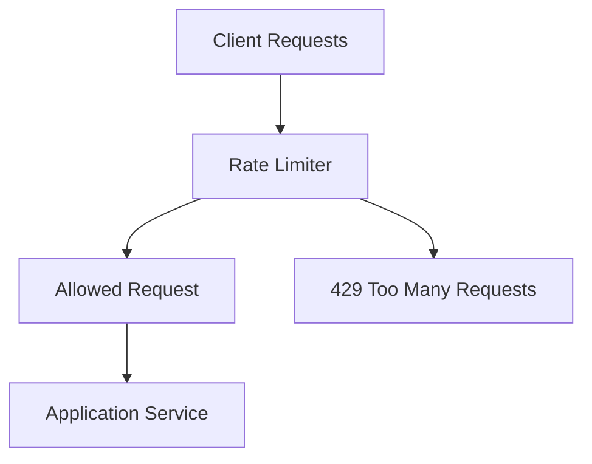
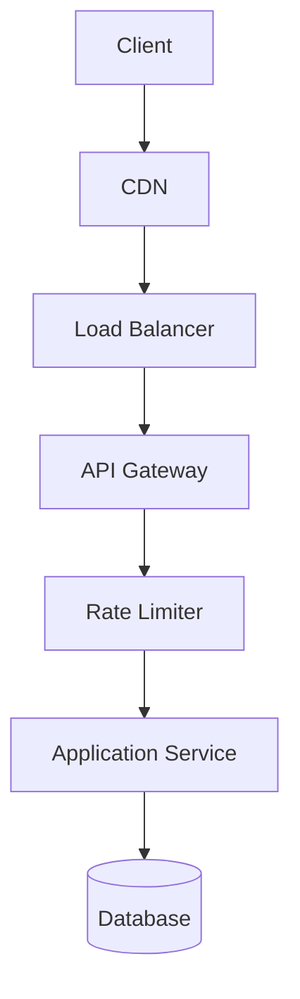
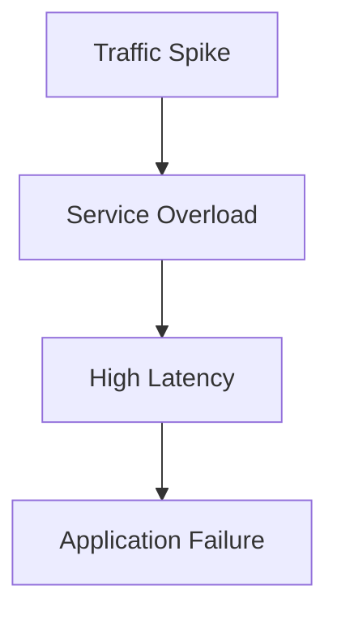
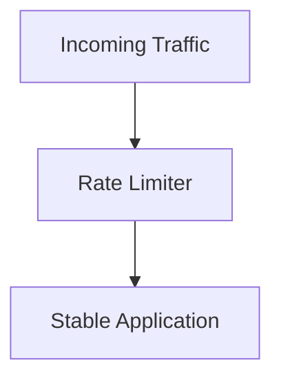
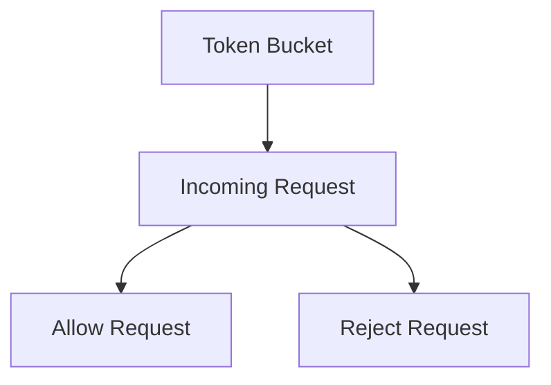
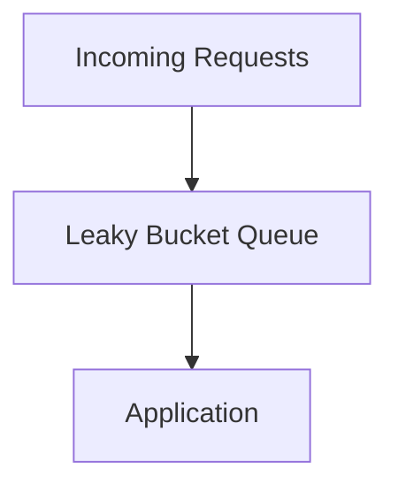
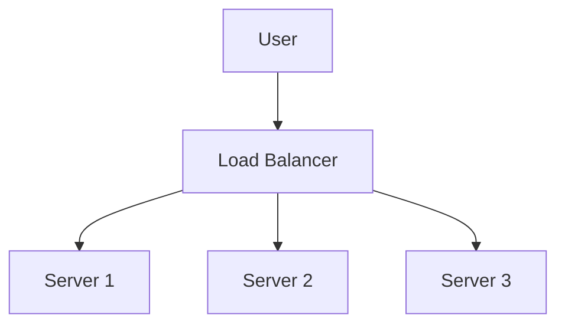
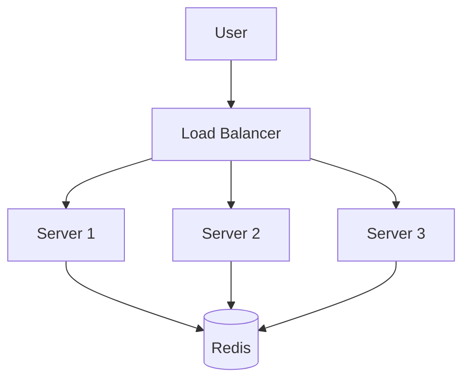

# Rate Limiter Diagram

## Why It Matters

A Rate Limiter controls how many requests a client can make within a specific period of time.

It protects applications from:

- Traffic spikes
- API abuse
- Bot attacks
- Resource exhaustion
- Denial of Service attacks
- Unexpected traffic growth

Rate limiting is one of the most important defensive mechanisms in modern distributed systems.

Common use cases:

- Public APIs
- Authentication Services
- Payment Systems
- API Gateways
- SaaS Platforms
- Cloud Services

---

## High-Level Architecture



The Rate Limiter decides whether a request should proceed or be rejected.

---

## Production Request Flow



Typical production flow:

1. Client sends request.
2. CDN handles static content.
3. Load Balancer distributes traffic.
4. API Gateway processes request.
5. Rate Limiter validates request quota.
6. Allowed requests reach application.
7. Application accesses database.
8. Response returned to client.

---

## Why Do We Need Rate Limiting?

### Without Rate Limiting



Problems:

- Resource exhaustion
- API abuse
- Increased latency
- Reduced availability
- Infrastructure instability

---

### With Rate Limiting



Benefits:

- Traffic control
- Predictable performance
- Better availability
- Infrastructure protection

---

## Rate Limiting Algorithms

### Token Bucket

Tokens are added periodically.

Each request consumes one token.



Behavior:

```text
Bucket Capacity = 100 Tokens

Request Arrives
       ↓
Token Available?
       ↓
Yes → Allow
No  → Reject
```

Advantages:

- Supports burst traffic
- Flexible
- Widely used

Best For:

- Public APIs
- API Gateways

---

### Leaky Bucket

Requests enter a queue and leave at a fixed rate.



Advantages:

- Smooth traffic flow
- Prevents sudden spikes

Best For:

- Stable request processing

---

### Fixed Window Counter

Requests counted within a fixed time window.

```text
100 Requests
Per Minute
```

Example:

```text
12:00 → Counter Reset

100 Requests Allowed

101st Request
      ↓
Rejected
```

Advantages:

- Simple
- Easy to implement

Disadvantages:

- Boundary problems

---

### Sliding Window Counter

Uses a rolling time window.

```text
Current Time
      ↓
Last 60 Seconds
      ↓
Request Count
```

Advantages:

- More accurate
- Better traffic control

Best For:

- Production APIs

---

## Distributed Rate Limiting

Single-instance rate limiting does not work well in distributed systems.

### Problem



Each server maintains its own counter.

Result:

```text
Limit = 100 Requests

Server 1 = 100
Server 2 = 100
Server 3 = 100

Actual Traffic = 300
```

Rate limiting becomes inaccurate.

---

### Distributed Solution



A shared datastore provides a centralized request counter.

Common choices:

- Redis
- Memcached
- Distributed Cache

---

## HTTP 429 Response

When limits are exceeded:

```http
HTTP/1.1 429 Too Many Requests
```

Example:

```json
{
  "error": "Rate limit exceeded",
  "retry_after": 60
}
```

Purpose:

- Inform clients
- Protect services
- Prevent overload

---

## Production Examples

### API Gateway

Commonly enforces:

- Per-user limits
- Per-API limits
- Per-IP limits

---

### Authentication Systems

Protects:

- Login endpoints
- Password reset APIs
- OTP verification

---

### Payment Platforms

Protects:

- Payment APIs
- Transaction APIs

---

### Cloud Services

Protects:

- Public APIs
- Infrastructure services

---

## Common Production Problems

### Rate Limit Too Strict

Symptoms:

- Legitimate users blocked

Possible Causes:

- Low thresholds
- Incorrect configuration

---

### Rate Limit Too Relaxed

Symptoms:

- Service overload

Possible Causes:

- High thresholds
- Missing protections

---

### Distributed Counter Failure

Symptoms:

- Inconsistent request limits

Possible Causes:

- Redis outage
- Cache inconsistency

---

### Shared IP Problems

Symptoms:

- Multiple users blocked together

Possible Causes:

- IP-based limiting
- NAT environments

---

## Interview Questions

### Basic

- What is Rate Limiting?
- Why do we need it?
- What problems does it solve?

### Intermediate

- Token Bucket vs Leaky Bucket?
- Fixed Window vs Sliding Window?
- What is HTTP 429?

### Advanced

- How does distributed rate limiting work?
- Why is Redis commonly used?
- How would you design a global rate limiter?
- How would you handle millions of requests per second?

---

## Quick Revision

```text
Rate Limiter
→ Traffic Protection

Token Bucket
→ Burst Traffic Support

Leaky Bucket
→ Smooth Traffic

Fixed Window
→ Simple Implementation

Sliding Window
→ Better Accuracy

Redis
→ Distributed Counter

HTTP 429
→ Too Many Requests

Main Benefits
→ Reliability
→ Availability
→ Abuse Prevention
→ Infrastructure Protection
```

---

## Key Concepts

| Concept | Description |
|----------|----------|
| Rate Limiter | Controls request volume |
| Token Bucket | Allows bursts using tokens |
| Leaky Bucket | Processes requests at fixed rate |
| Fixed Window | Time-based request counting |
| Sliding Window | Rolling request counting |
| Redis | Distributed request counter |
| HTTP 429 | Too Many Requests |
| API Protection | Prevents abuse |
| Availability | Maintains service health |
| Traffic Control | Protects infrastructure |