# Replication Diagram

## Why It Matters

Replication is the process of copying data from one database server to one or more replica servers.

Replication helps systems:

- Improve availability
- Improve fault tolerance
- Improve read scalability
- Reduce downtime
- Improve disaster recovery
- Support global deployments

Almost every large-scale distributed system uses replication.

Common use cases:

- Banking Platforms
- E-Commerce Systems
- Social Media Platforms
- Streaming Platforms
- SaaS Applications

---

## High-Level Architecture

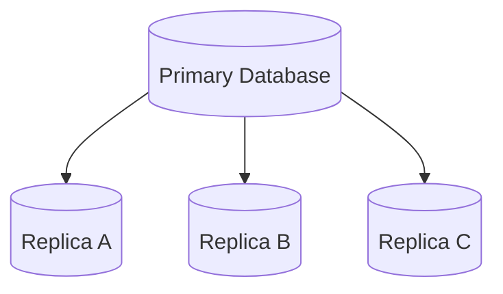

The primary database handles writes.

Replicas receive copied data from the primary.

---

## Production Request Flow

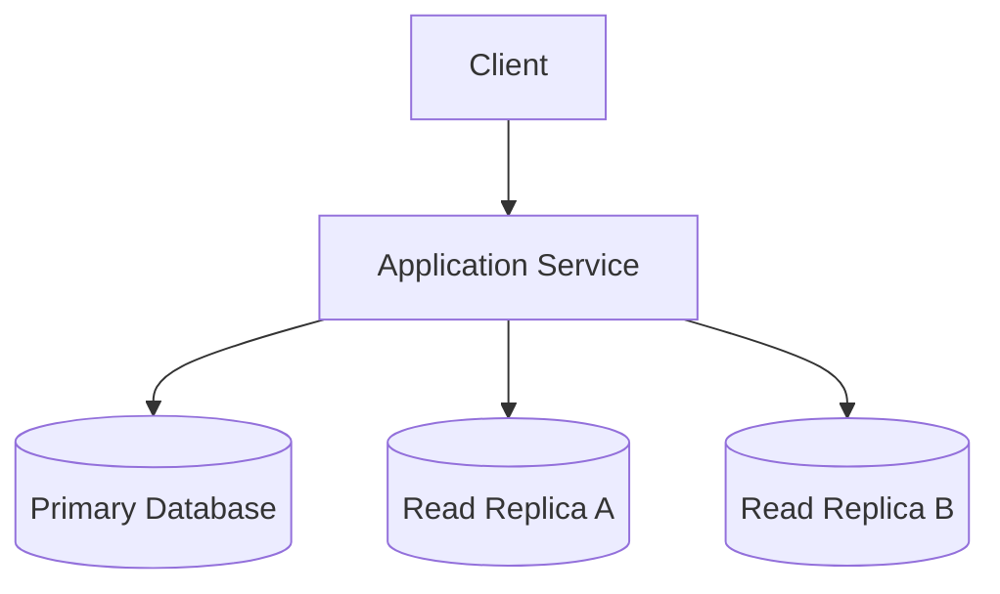

Typical pattern:

```text
Writes
      ↓
Primary Database

Reads
      ↓
Read Replicas
```

Benefits:

- Improved read scalability
- Reduced primary load

---

## Why Do We Need Replication?

### Without Replication

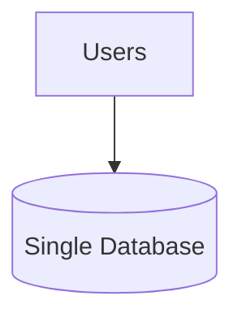

Problems:

- Single point of failure
- Read bottleneck
- Limited scalability
- Higher downtime risk

---

### With Replication

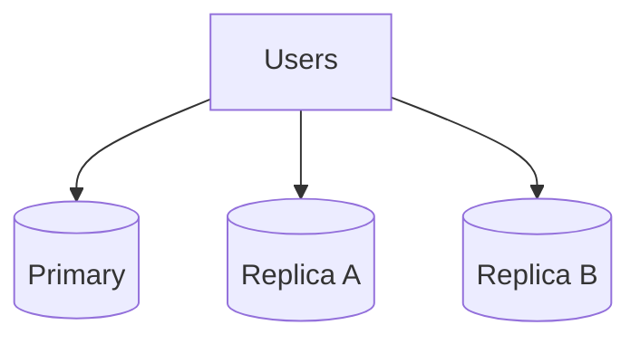

Benefits:

- Better availability
- Better fault tolerance
- Better performance

---

## Primary Replica Replication

The most common replication model.

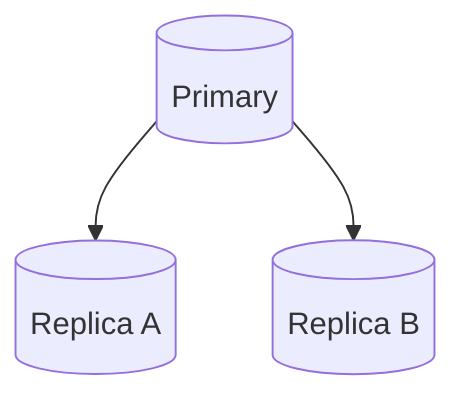

Characteristics:

- Writes go to primary
- Reads go to replicas
- Simple architecture

Advantages:

- Easy implementation
- Better read scalability

Disadvantages:

- Primary remains write bottleneck

Best For:

- Read-heavy systems

---

## Multi Primary Replication

Multiple databases accept writes.

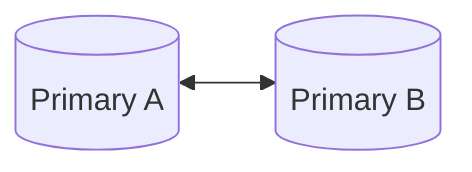

Advantages:

- Better write availability
- Geo-distributed deployments

Disadvantages:

- Conflict resolution
- Increased complexity

Best For:

- Global applications

---

## Synchronous Replication

Primary waits for replica confirmation.

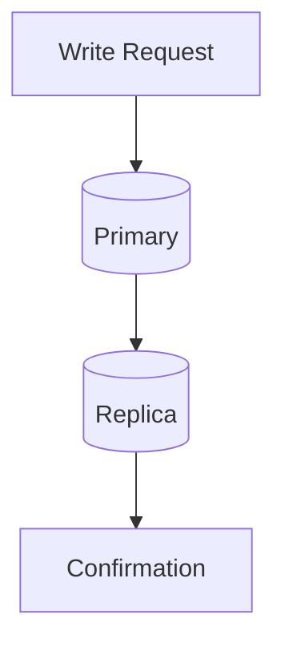

Advantages:

- Strong consistency
- No data loss

Disadvantages:

- Higher latency

Best For:

- Banking
- Financial systems

---

## Asynchronous Replication

Primary responds immediately.

Replica updates later.

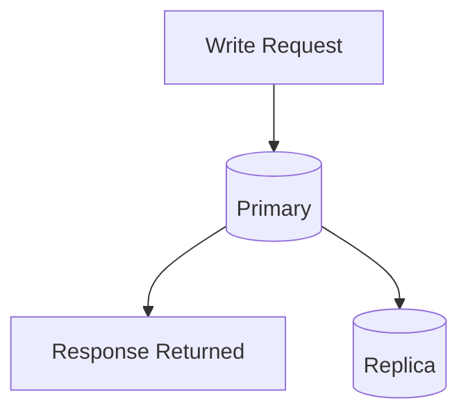

Advantages:

- Faster writes
- Better performance

Disadvantages:

- Replication lag

Best For:

- Social media
- E-commerce

---

## Replication Lag

Replication takes time.

### Example

```text
Write To Primary
       ↓
Replica Not Updated Yet
       ↓
User Reads Old Value
```

### Replication Lag Flow

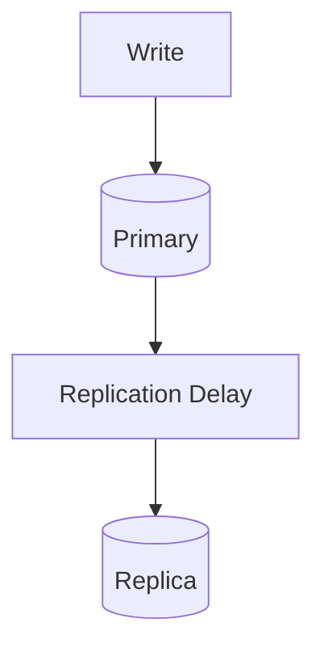

Problems:

- Stale reads
- Inconsistent user experience

---

## Read Replica Strategy

Critical reads may bypass replicas.

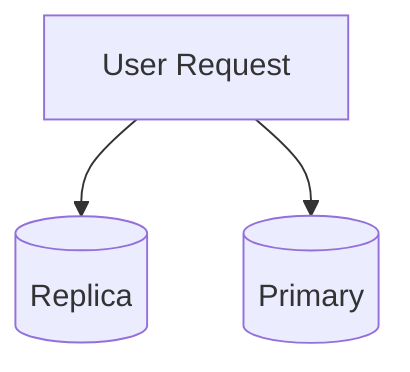

Common approach:

```text
Normal Reads
      ↓
Replica

Critical Reads
      ↓
Primary
```

Examples:

- Account balance
- Payment status
- Order confirmation

---

## Failover Process

When primary fails:

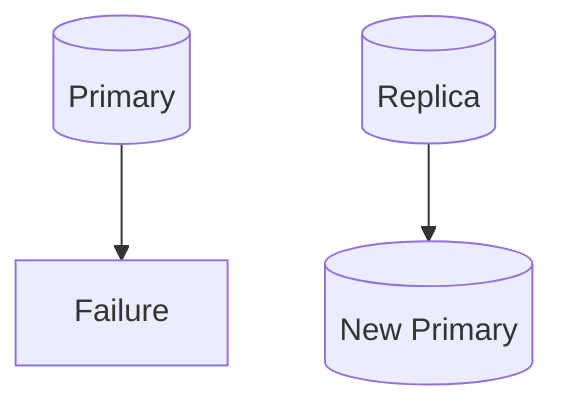

Steps:

1. Detect failure.
2. Promote replica.
3. Redirect traffic.
4. Resume operations.

Benefits:

- Reduced downtime
- High availability

---

## Replication vs Backup

| Replication | Backup |
|------------|------------|
| Real-time copy | Point-in-time copy |
| Improves availability | Improves recovery |
| Supports failover | Supports restoration |
| Not replacement for backup | Long-term protection |

Important:

```text
Replication ≠ Backup
```

Both are required.

---

## Production Examples

### MySQL Replication

Used for:

- Read scaling
- High availability

---

### PostgreSQL Replication

Used for:

- Disaster recovery
- Read replicas

---

### MongoDB Replica Set

Used for:

- Automatic failover
- High availability

---

### Cassandra

Uses replication across nodes.

Benefits:

- High availability
- Fault tolerance

---

## Common Production Problems

### Replication Lag

Symptoms:

```text
Users See Old Data
```

Cause:

```text
Replica Behind Primary
```

---

### Replica Failure

Symptoms:

```text
Reduced Read Capacity
```

Cause:

```text
Replica Outage
```

---

### Primary Failure

Symptoms:

```text
Writes Stop Working
```

Cause:

```text
Primary Database Down
```

---

### Split Brain

Symptoms:

```text
Multiple Primaries
```

Cause:

```text
Network Partition
```

Impact:

- Data inconsistency
- Conflict resolution challenges

---

## Replication vs Sharding

| Replication | Sharding |
|------------|------------|
| Copies data | Splits data |
| Improves reads | Improves writes |
| Improves availability | Improves scalability |
| Same dataset | Different datasets |

### Replication

```text
Node A
      ↓
Copy Data
      ↓
Node B
```

### Sharding

```text
Users 1-1M
      ↓
Shard A

Users 1M-2M
      ↓
Shard B
```

---

## Interview Questions

### Basic

- What is replication?
- Why do we need replication?
- What problems does it solve?

### Intermediate

- Synchronous vs Asynchronous replication?
- Replication vs Backup?
- Replication vs Sharding?

### Advanced

- What is replication lag?
- How would you handle failover?
- How would you design a global replication system?
- What is split brain?

---

## Quick Revision

```text
Replication
→ Copy Data

Primary
→ Write Traffic

Replica
→ Read Traffic

Synchronous
→ Strong Consistency

Asynchronous
→ Better Performance

Replication Lag
→ Stale Read Risk

Failover
→ Promote Replica

Replication
→ Read Scaling

Sharding
→ Write Scaling
```

---

## Key Concepts

| Concept | Description |
|----------|----------|
| Replication | Copying data across nodes |
| Primary | Accepts writes |
| Replica | Serves reads |
| Synchronous Replication | Waits for replica acknowledgment |
| Asynchronous Replication | Updates replicas later |
| Replication Lag | Delay between nodes |
| Failover | Promote replica after failure |
| Read Scaling | Distribute read traffic |
| High Availability | Reduce downtime |
| Split Brain | Multiple active primaries |