# Sharding Diagram

## Why It Matters

Sharding is the process of splitting data across multiple database servers.

As systems grow, a single database eventually becomes a bottleneck because of:

- Storage limitations
- CPU limitations
- Memory limitations
- Write throughput limitations

Sharding enables horizontal scaling by distributing data across multiple database nodes.

Common use cases:

- Social Media Platforms
- E-Commerce Systems
- Streaming Platforms
- SaaS Platforms
- Analytics Platforms

---

## Single Database Problem

### Traditional Architecture

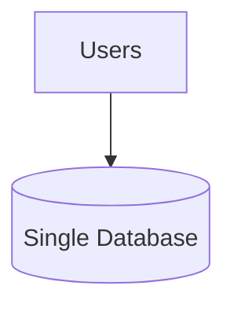

Problems:

- Limited storage
- Limited write throughput
- Higher latency
- Difficult scaling

As traffic grows:

```text
More Users
      ↓
More Data
      ↓
More Writes
      ↓
Database Bottleneck
```

---

## What Is Sharding?

Sharding partitions data into multiple independent databases.

Each database stores only a subset of the total dataset.

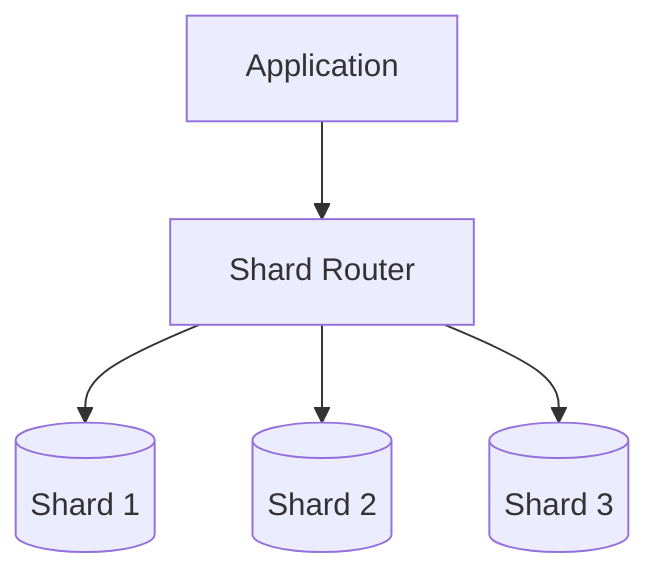

Benefits:

- Horizontal scaling
- Higher throughput
- Better scalability
- Reduced database bottlenecks

---

## Production Request Flow

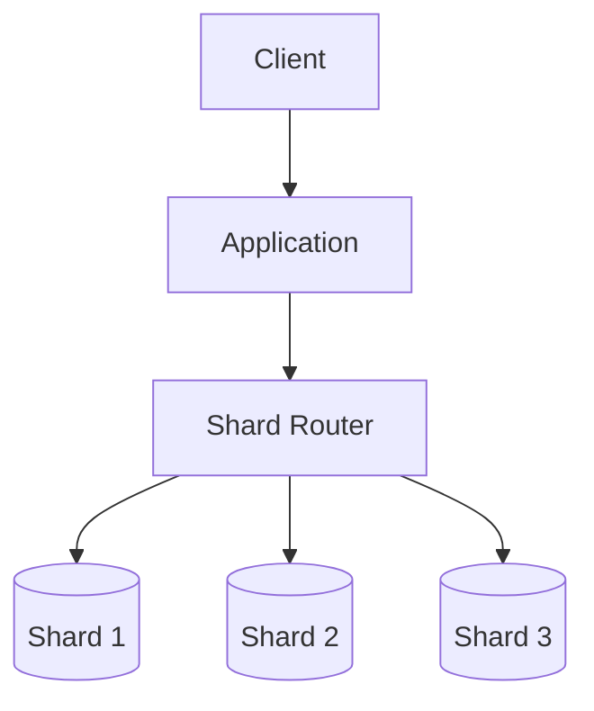

Flow:

1. Request reaches application.
2. Application determines shard.
3. Router directs request.
4. Correct shard serves request.
5. Response returned.

---

## Example Sharding

### User-Based Sharding

```text
Users A-F
      ↓
Shard 1

Users G-M
      ↓
Shard 2

Users N-Z
      ↓
Shard 3
```

Each shard stores only a portion of the users.

---

## Range-Based Sharding

Data assigned using value ranges.

### Example

```text
User ID 1 - 100000
      ↓
Shard 1

User ID 100001 - 200000
      ↓
Shard 2

User ID 200001 - 300000
      ↓
Shard 3
```

### Architecture

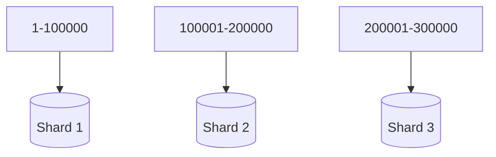

Advantages:

- Simple
- Easy to understand

Disadvantages:

- Hot shard risk
- Uneven traffic distribution

Best For:

- Ordered datasets

---

## Hash-Based Sharding

Data assigned using a hash function.

### Flow

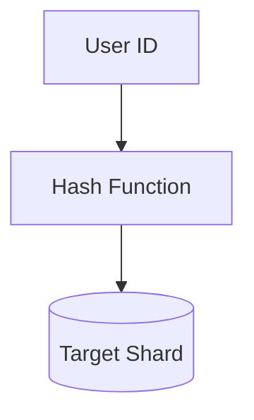

Example:

```text
Hash(UserID)
       ↓
Shard Selection
```

Advantages:

- Better distribution
- Balanced traffic

Disadvantages:

- Rebalancing complexity

Best For:

- Large-scale systems

---

## Directory-Based Sharding

A lookup service determines shard location.

### Architecture

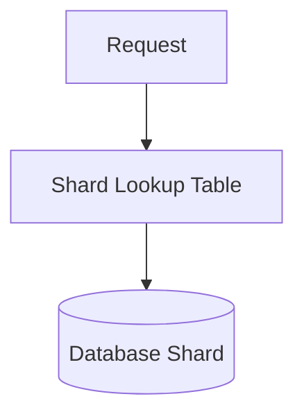

Advantages:

- Flexible routing
- Easier migrations

Disadvantages:

- Metadata dependency
- Additional complexity

Best For:

- Complex enterprise systems

---

## Shard Key Selection

The shard key determines data distribution.

### Good Shard Key

```text
User ID
Order ID
Customer ID
```

Characteristics:

- High cardinality
- Even distribution
- Predictable access

---

### Bad Shard Key

```text
Country
Gender
Status
```

Problems:

- Uneven distribution
- Hot shards
- Scalability issues

---

## Hot Shard Problem

A shard receives significantly more traffic than others.

### Example

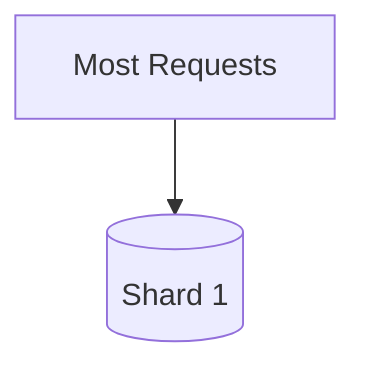

Result:

```text
Shard 1 Overloaded

Shard 2 Underutilized

Shard 3 Underutilized
```

Problems:

- High latency
- Reduced throughput
- Uneven resource usage

Solutions:

- Better shard key
- Resharding
- Hash-based distribution

---

## Rebalancing

As systems grow, new shards may be added.

### Before Scaling

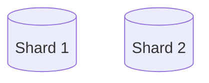

### After Scaling

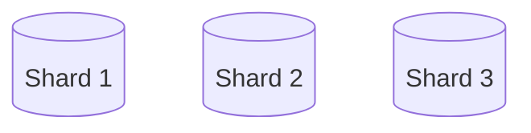

Challenge:

```text
Move Existing Data
      ↓
Maintain Availability
```

Problems:

- Data migration
- Temporary performance impact

---

## Cross-Shard Queries

Some queries require data from multiple shards.

### Example

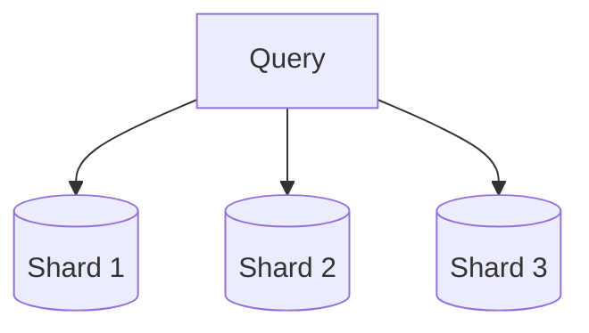

Problems:

- Higher latency
- Increased complexity
- Distributed joins

Common Solutions:

- Data denormalization
- Aggregation services
- Search systems

---

## Sharding and Replication

Most production systems combine both.

### Combined Architecture

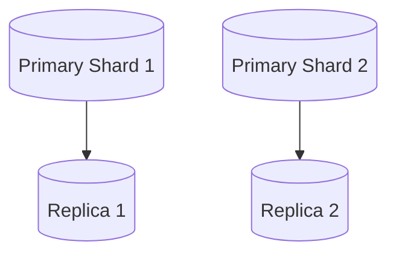

Benefits:

- Write scalability
- Read scalability
- High availability

---

## Failure Scenario

### Shard Failure

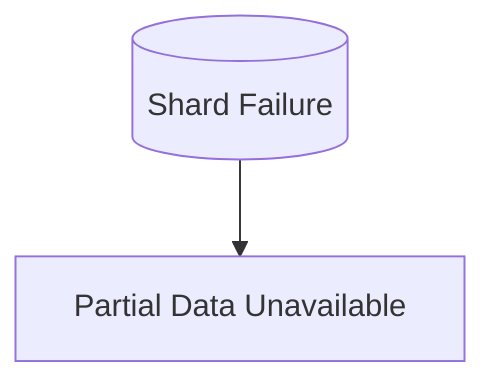

Impact:

- Some users affected
- Partial outage

---

### Router Failure

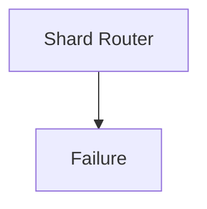

Impact:

- Routing unavailable
- Request failures

Solutions:

- Multiple routers
- High availability deployment

---

## Production Examples

### Instagram

Uses sharding for:

- User data
- Social graph
- Activity data

---

### Facebook

Uses sharding for:

- User profiles
- Social relationships
- Messaging data

---

### Amazon

Uses sharding for:

- Product catalog
- Orders
- Customer data

---

### Uber

Uses sharding for:

- Trip data
- Driver data
- Location services

---

## Sharding vs Replication

| Sharding | Replication |
|----------|----------|
| Splits data | Copies data |
| Improves write scalability | Improves read scalability |
| Different datasets | Same dataset |
| Horizontal growth | High availability |
| Data partitioning | Data duplication |

### Replication

```text
Database
      ↓
Copy Data
      ↓
Replica
```

### Sharding

```text
Database
      ↓
Split Data
      ↓
Multiple Shards
```

---

## Common Production Problems

### Hot Shards

Symptoms:

```text
One Shard Overloaded
```

---

### Rebalancing Complexity

Symptoms:

```text
Migration Challenges
```

---

### Cross-Shard Queries

Symptoms:

```text
Slow Queries
```

---

### Uneven Distribution

Symptoms:

```text
Resource Imbalance
```

---

## Interview Questions

### Basic

- What is sharding?
- Why do we need sharding?
- What problems does it solve?

### Intermediate

- Range vs Hash sharding?
- What is a shard key?
- What is a hot shard?

### Advanced

- How would you choose a shard key?
- How would you handle rebalancing?
- How would you design sharding for 100 million users?
- How does sharding differ from replication?

---

## Quick Revision

```text
Sharding
→ Data Partitioning

Primary Goal
→ Horizontal Scaling

Range Sharding
→ Simple But Uneven

Hash Sharding
→ Better Distribution

Directory Sharding
→ Flexible Routing

Shard Key
→ Determines Placement

Hot Shard
→ Uneven Traffic

Rebalancing
→ Data Movement

Replication
→ Read Scaling

Sharding
→ Write Scaling
```

---

## Key Concepts

| Concept | Description |
|----------|----------|
| Sharding | Splitting data across databases |
| Shard | Individual database partition |
| Shard Key | Determines shard placement |
| Range Sharding | Partition by ranges |
| Hash Sharding | Partition using hash function |
| Directory Sharding | Partition using lookup table |
| Hot Shard | Uneven traffic concentration |
| Rebalancing | Moving data between shards |
| Cross-Shard Query | Query spanning multiple shards |
| Horizontal Scaling | Add more database nodes |